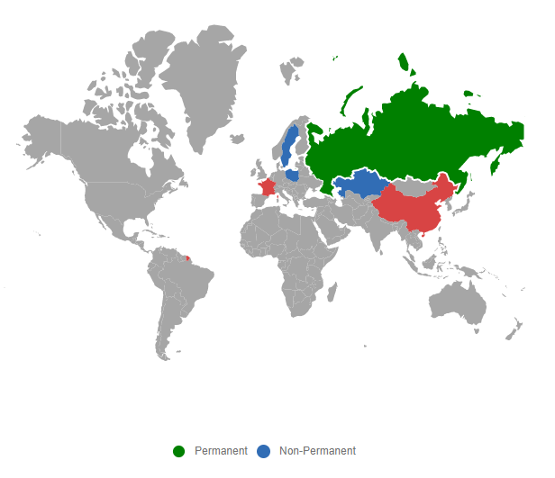
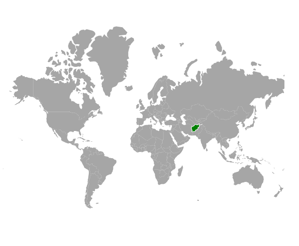
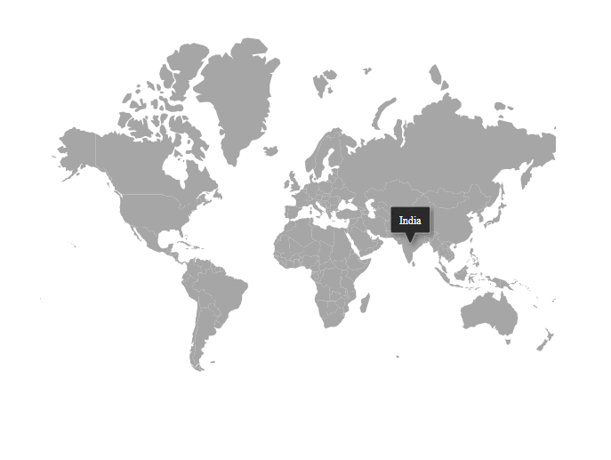

# User Interactions

## Zooming

The zooming feature is used to zoom in and out of Maps to show in-depth information. It is controlled by the `ZoomFactor` property of the `MapsZoomSettings` of the Maps. The `ZoomFactor` is increased or decrease dynamically based on zoom in and out interaction.

<b>Enable zooming</b>

Zooming of Maps is enabled by setting the `Enable` property of `MapsZoomSettings` to **true**.

<b>Enable panning</b>

To enable the panning feature, set the `EnablePanning` property of `MapsZoomSettings` to **true**.
























### Various type of zooming

Zooming can be performed in following types:

#### Zooming toolbar

By default, the toolbar is rendered with **zoom-in**, **zoom-out**, and **reset** options when it is set to **true** in the `Enable` property of `MapsZoomSettings`.

The following options are available in toolbar.

1. Zoom - Provides rectangular zoom support.
2. ZoomIn - Zoom in the Maps.
3. ZoomOut - Zoom out the Maps.
4. Pan - Switches to panning if rectangular zoom is activated.
5. Reset - Restores the Maps to the default view.

The following properties are available in toolbars to customize the zooming toolbars.

* `Color` - To apply the color for toolbars in Maps.
* `HighlightColor` - To apply the color for the zooming toolbar when the mouse has hovered on the toolbar element in Maps.
* `HorizontalAlignment` - To customize the position type of toolbar when it is placed horizontally.
* `SelectionColor` - To apply the color for the zooming toolbar when clicking the zooming toolbar in Maps.
* `ToolBarOrientation` - To customize the orientation of the zooming toolbar.
* `Toolbars` - To customize the items that are to be shown in the zooming toolbar in Maps.
* `VerticalAlignment` - To customize the position type of toolbar when it is placed vertically.
























#### Pinch zooming

To enable or disable the pinch zooming, use the `PinchZooming` property in `MapsZoomSettings`.
























#### Single-click zooming

To enable or disable the single-click zooming, use the `ZoomOnClick` property in `MapsZoomSettings`.
























#### Double-click zooming

To enable or disable the double-click zooming, use the `DoubleClickZoom` property in `MapsZoomSettings`.
























#### Mouse wheel zooming

To enable or disable mouse wheel zooming, use the `MouseWheelZoom` property in `MapsZoomSettings`.
























#### Selection zooming

To enable or disable selection zooming, use the `EnableSelectionZooming` property in `MapsZoomSettings`. The `EnablePanning` property must be set to **false** to enable the selection zooming in Maps.
























### Setting minimum and maximum values for zoom factor

The zooming range can be adjusted using the `MinZoom` and `MaxZoom` properties in `MapsZoomSettings`. The minZoom value is set to 1 by default, and the maxZoom value is set to 10.
























### Zooming with animation

To zoom in or zoom out the Maps with animation, use the `AnimationDuration` property in `MapsLayer`.
























## Selection

Each shape in the Maps can be selected and deselected during interaction with the shapes. Selection is enabled by setting the `Enable` property of `MapsSelectionSettings` to **true**.

The following properties are available to customize the selection of Maps elements such as shapes, bubbles, markers and legends.

* `Border` - To customize the color, width and opacity of the border of which element is selected in Maps.
* `Fill` - Applies the color for the element that is selected.
* `Opacity` - To customize the transparency for the element that is selected.
* `EnableMultiSelect` - To enable or disable the selection for multiple shapes or markers or bubbles in the Maps.

By tapping on the specific legend, the shapes which are bounded to the selected legend is also selected and vice versa.
























### Enable selection for bubbles

To enable the selection for bubbles in Maps, set the `MapsSelectionSettings` in `MapsBubble` and set the `Enable` property of `MapsSelectionSettings` as **true**.
























### Enable selection for markers

To enable the selection for markers in Maps, set the `MapsSelectionSettings` in the `MapsMarker` and set the `Enable` property of the `MapsSelectionSettings` as **true**.
























### Public method for the shape selection

The `shapeSelection` method can be used to select each shape in the Maps. LayerIndex, propertyName, country name, and selected value as a boolean state(true / false) are the input parameters for this method.
























### Initial shape selection

The shape is initially selected using the `MapsInitialShapeSelection`, and the values are mapped to the `ShapePath` and `ShapeValue`.
























### Initial marker selection

Using the `InitialMarkerSelection`, the marker shape can be selected initially. Markers render based on the `Latitude` and `Longitude` values.
























## Highlight

Each shape in the Maps can be highlighted during mouse hover on the Maps elements such as shapes, bubbles, markers and legends. Highlight is enabled by setting the `Enable` property of `MapsHighlightSettings` to **true**.

The following properties are available to customize the highlight of Maps elements such as shapes, bubbles, markers and legends.

* `Border` - To customize the color, width and opacity of the border of which element is highlighted in Maps.
* `Fill` - Applies the color for the element that is highlighted.
* `Opacity` - To customize the transparency for the element that is highlighted.

Hovering on the specific legend, the shapes which are bounded to the selected legend is also highlighted and vice versa.
























### Enable highlight for bubbles

To enable the highlight for bubbles in Maps, set the `MapsHighlightSettings` in `MapsBubble` and set the `Enable` property of `MapsHighlightSettings` as **true**.
























### Enable highlight for markers

To enable the highlight for markers in Maps, set the `MapsHighlightSettings` in `MapsMarker` and set the `Enable` property of `MapsHighlightSettings` as **true**.
























## Tooltip

On mouse over or touch end event, the tooltip is used to get more information about the layer, bubble, or marker. It can be enabled separately for layer or bubble or marker by using the `Visible` property of `MapsTooltipSettings` as **true**. The `ValuePath` property in the tooltip takes the field name that presents in data source and displays that value as tooltip text. The `TooltipDisplayMode` property is used to change the display mode of the tooltip in Maps. Following display modes of tooltip are available in the Maps component. By default, `TooltipDisplayMode` is set to **MouseMove**.
























### Customization

The following properties are available in the `MapsTooltipSettings` to customize the tooltip of the Maps component.

* `Border` - To customize the color, width and opacity of the border of the tooltip in layers, markers, and bubbles of Maps.
* `Fill` - Applies the color of the tooltip in layers, markers, and bubbles of Maps.
* `Format` - To customize the format of the tooltip in layers, markers, and bubbles of Maps
* `TextStyle` - To customize the style of the text in the tooltip for layers, markers, and bubbles of Maps.
























### Tooltip template

The HTML element can be rendered in the tooltip of the Maps using the `Template` property of the `MapsTooltipSettings`. In the following example, ${value1} and ${value2} are the place holders in the HTML element to display the value1 and value2 values of the corresponding shape.
























