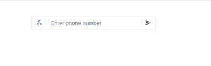

# Adornments in ##Platform_Name## MaskedTextBox control

Adornments in the MaskedTextBox control allow you to add custom elements before or after the masked input using the `prependTemplate` and `appendTemplate` properties. These elements can include prefixes, suffix labels, or action icons to provide context, guide user input, and offer quick actions while preserving mask validation and float label behavior.

## Common Use Cases

- **Entry Guidance**: Add icons/text to hint the expected input (e.g., user icon for username/login).
- **Quick Actions**: Include buttons to submit, clear, or copy the masked value.
- **Context Labels**: Add static prefixes/suffixes like country code, domain, or unit suffix.
- **Visual Feedback**: Show status indicators without interfering with the mask.

## Adding Adornments to MaskedTextBox

Use `prependTemplate` and `appendTemplate` to inject HTML content before and after the masked input respectively. These templates do not alter mask behavior and support any inline HTML or icon.

- **prependTemplate**: Renders elements before the masked input.
- **appendTemplate**: Renders elements after the masked input.

The following example demonstrates how to add adornments in the MaskedTextBox control.


















Output be like the below.

