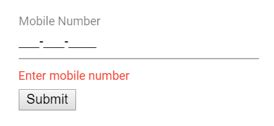

# Perform custom validation using FormValidator

To perform custom validation on the MaskedTextBox use the FormValidator along with custom validation rules.

In the following example, the MaskedTextBox is validated for invalid mobile number by adding custom validation in the rules collection of the FormValidator.
























Output be like the below.

