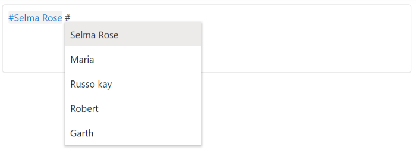
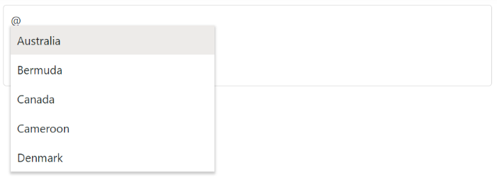

# Customization

The Mention control allows the user to control the mentioned character and custom text to be displayed by using the [ShowMentionChar](https://help.syncfusion.com/cr/aspnetmvc-js2/Syncfusion.EJ2.DropDowns.Mention.html#Syncfusion_EJ2_DropDowns_Mention_ShowMentionChar) and [SuffixText](https://help.syncfusion.com/cr/aspnetmvc-js2/Syncfusion.EJ2.DropDowns.Mention.html#Syncfusion_EJ2_DropDowns_Mention_SuffixText) properties. Also, user can customize the popup height and width using the [PopupHeight](https://help.syncfusion.com/cr/aspnetmvc-js2/Syncfusion.EJ2.DropDowns.Mention.html#Syncfusion_EJ2_DropDowns_Mention_PopupHeight) and [PopupWidth](https://help.syncfusion.com/cr/aspnetmvc-js2/Syncfusion.EJ2.DropDowns.Mention.html#Syncfusion_EJ2_DropDowns_Mention_PopupWidth) properties.

## Show or hide mention character

You can show mention character as prefix of selected item in mention component using [showMentionChar](https://help.syncfusion.com/cr/aspnetmvc-js2/Syncfusion.EJ2.DropDowns.Mention.html#Syncfusion_EJ2_DropDowns_Mention_ShowMentionChar) property. The default value of `showMentionChar` is `false`.

The following example displays the text content along with the customized mentioned character as **#**.










## Adding the suffix character after selection

You can add suffix character while selecting an item in Mention component using [SuffixText](https://help.syncfusion.com/cr/aspnetmvc-js2/Syncfusion.EJ2.DropDowns.Mention.html#Syncfusion_EJ2_DropDowns_Mention_SuffixText) property. You can add space or new line as suffix to the selected item. The default values is empty string.

The following example displays the white space next to the text selected since the suffixText is configured as `&nbsp;`.










## Configure the popup list

By default, the width of the popup list adjusts automatically according to the mentioned suggestion list data's width, and the height of the popup list is `300px`. They can also be customized using the [PopupHeight](https://help.syncfusion.com/cr/aspnetmvc-js2/Syncfusion.EJ2.DropDowns.Mention.html#Syncfusion_EJ2_DropDowns_Mention_PopupHeight) and [PopupWidth](https://help.syncfusion.com/cr/aspnetmvc-js2/Syncfusion.EJ2.DropDowns.Mention.html#Syncfusion_EJ2_DropDowns_Mention_PopupWidth) properties respectively.

In the following sample, popup list's width and height are configured.










