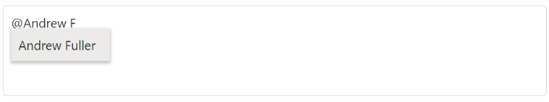

# Filtering

The Mention control has built-in support to filter data items. The filter operation starts as soon as you start typing characters in the mention element.

## Limit the minimum filter character

When filtering the list items, you can set the limit for character count to raise a remote request and fetch filtered data on the mention control. This can be done by configuring the [MinLength](https://help.syncfusion.com/cr/aspnetmvc-js2/Syncfusion.EJ2.DropDowns.Mention.html#Syncfusion_EJ2_DropDowns_Mention_MinLength) property.

The remote request does not fetch the search data until the search key contains three characters as shown in the following example.










## Change the filter type

While filtering, you can change the filter type to `Contains`, `StartsWith`, or `EndsWith` for string type within the [FilterType](https://help.syncfusion.com/cr/aspnetmvc-js2/Syncfusion.EJ2.DropDowns.Mention.html#Syncfusion_EJ2_DropDowns_Mention_FilterType) property.

In the following examples, data filtering is done with `StartsWith` type.










## Allow spacing between search

While filtering, you can allow the space in the middle of the mention while searching the data in the data source by using the [AllowSpaces](https://help.syncfusion.com/cr/aspnetmvc-js2/Syncfusion.EJ2.DropDowns.Mention.html#Syncfusion_EJ2_DropDowns_Mention_AllowSpaces) property. If the data source does not match with the mentioned element data, the popup will be hidden.

> By default, the `AllowSpaces` property is disabled, and the space ends the mention control search.

In the following example, `AllowSpaces` property is enabled and the filtering waits after the space action










## Customize the suggestion item count

With the large amount of data source data bound for the Mention control, you can customize the number of list items to be displayed in the popup by using the [SuggestionCount](https://help.syncfusion.com/cr/aspnetmvc-js2/Syncfusion.EJ2.DropDowns.Mention.html#Syncfusion_EJ2_DropDowns_Mention_SuggestionCount) property.

In the following example, the suggestion list for the popup is limited to eight data.










## See Also

* [Templates](./template)

