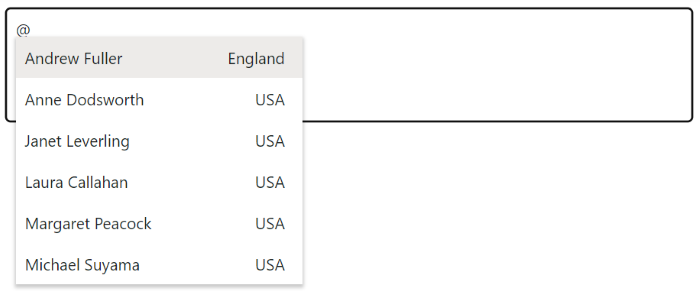
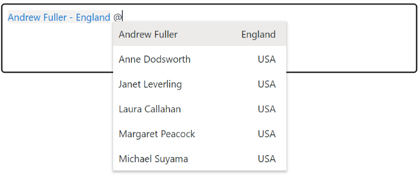
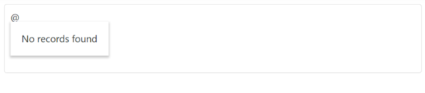

# Templates

The Mention has been provided with several options to customize each list item, display item and waiting popup. It uses the Essential JS 2 [Template engine](../../common/template-engine) to compile and render the elements properly.

## Item template

The content of each list item within the Mention can be customized with the help of [ItemTemplate](https://help.syncfusion.com/cr/aspnetmvc-js2/Syncfusion.EJ2.DropDowns.Mention.html#Syncfusion_EJ2_DropDowns_Mention_ItemTemplate) property.

In the following sample, each list item is split into two columns to display relevant data.










## Display template

The currently selected value that is to be displayed on the mention element can be customized using the [DisplayTemplate](https://help.syncfusion.com/cr/aspnetmvc-js2/Syncfusion.EJ2.DropDowns.Mention.html#Syncfusion_EJ2_DropDowns_Mention_DisplayTemplate) property.

In the following sample, the selected value is displayed as a combined text of both `FirstName` and `City` in the mention element, which is separated by a hyphen.










## No records template

The Mention is provided with support to custom design the popup list content when no data is found and no matches found on search with the help of [NoRecordsTemplate](https://help.syncfusion.com/cr/aspnetmvc-js2/Syncfusion.EJ2.DropDowns.Mention.html#Syncfusion_EJ2_DropDowns_Mention_NoRecordsTemplate) property.

In the following sample, popup list content displays the notification of no data available.










## Spinner template

The Mention provides support to customize the waiting spinner, when data fetching takes time to load respective data in the popup by using the [SpinnerTemplate](https://help.syncfusion.com/cr/aspnetmvc-js2/Syncfusion.EJ2.DropDowns.Mention.html#Syncfusion_EJ2_DropDowns_Mention_SpinnerTemplate) property.

In the following sample, customized spinner is shown while fetching the data from the service.










## See Also

* [How to acheive filtering](./filtering-data)