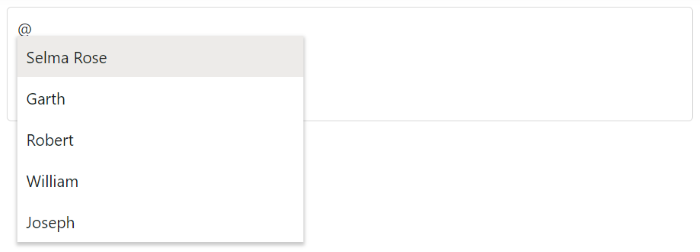

# Customization

The Mention control allows the user to control the mentioned character and custom text to be displayed by using the [showMentionChar](https://help.syncfusion.com/cr/aspnetmvc-js2/Syncfusion.EJ2.DropDowns.Mention.html#Syncfusion_EJ2_DropDowns_Mention_ShowMentionChar) and [suffixText](https://help.syncfusion.com/cr/aspnetmvc-js2/Syncfusion.EJ2.DropDowns.Mention.html#Syncfusion_EJ2_DropDowns_Mention_SuffixText) properties. Also, user can customize the popup height and width using the [popupHeight](https://help.syncfusion.com/cr/aspnetmvc-js2/Syncfusion.EJ2.DropDowns.Mention.html#Syncfusion_EJ2_DropDowns_Mention_PopupHeight) and [popupWidth](https://help.syncfusion.com/cr/aspnetmvc-js2/Syncfusion.EJ2.DropDowns.Mention.html#Syncfusion_EJ2_DropDowns_Mention_PopupWidth) properties.

## Show or hide mention character

By default, the `showMentionChar` which does not display the text content with the mentioned character is disabled. If the property [showMentionChar](https://help.syncfusion.com/cr/aspnetmvc-js2/Syncfusion.EJ2.DropDowns.Mention.html#Syncfusion_EJ2_DropDowns_Mention_ShowMentionChar) is enabled, it allows to display the respective [mentionChar](https://help.syncfusion.com/cr/aspnetmvc-js2/Syncfusion.EJ2.DropDowns.Mention.html#Syncfusion_EJ2_DropDowns_Mention_MentionChar) configured along with the text content opted from the suggested list to display.

The following example displays the text content along with the default mentioned character.







## Adding the suffix character after selection

The Mention has support to specify the custom suffix to append alongside with the mentioned selected item while inserting. You can append space or new line character as [suffixText](https://help.syncfusion.com/cr/aspnetmvc-js2/Syncfusion.EJ2.DropDowns.Mention.html#Syncfusion_EJ2_DropDowns_Mention_SuffixText).

The following example displays the white space next to the text selected since the suffixText is configured as `&nbsp;`.







## Configure the popup list

By default, the width of the popup list adjusts automatically according to the mentioned suggestion list data width, and the height of the popup list is `300px`. They can also be customized using the [popupHeight](https://help.syncfusion.com/cr/aspnetmvc-js2/Syncfusion.EJ2.DropDowns.Mention.html#Syncfusion_EJ2_DropDowns_Mention_PopupHeight) and [popupWidth](https://help.syncfusion.com/cr/aspnetmvc-js2/Syncfusion.EJ2.DropDowns.Mention.html#Syncfusion_EJ2_DropDowns_Mention_PopupWidth) properties respectively.

In the following sample, popup list's width and height are configured.







