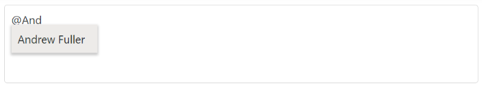
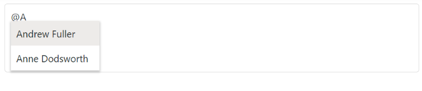

# Filtering

The Mention control has built-in support to filter data items. The filter operation starts as soon as you start typing characters in the mention element.

## Limit the minimum filter character

You can control the minimum length of user input to initiate the search action using [minLength](https://help.syncfusion.com/cr/aspnetmvc-js2/Syncfusion.EJ2.DropDowns.Mention.html#Syncfusion_EJ2_DropDowns_Mention_MinLength) property. This can be useful if you have a very large list of data. The default value is `zero`, where suggestion the list opened as soon as the user inputs the mention character.

The remote request does not fetch the search data until the search key contains three characters as shown in the following example.







## Change the filter type

While filtering, you can change the filter type to `Contains`, `StartsWith`, or `EndsWith` in the [filterType](https://help.syncfusion.com/cr/aspnetmvc-js2/Syncfusion.EJ2.DropDowns.Mention.html#Syncfusion_EJ2_DropDowns_Mention_FilterType) property. The default filter operator is `Contains`.

* StartsWith - Filter the items that begin with the specified text value.
* Contains - Filter the items that contain the specified text value.
* EndsWith - Filter the items that end with the specified text value.







## Allow spacing between search

While filtering the data in the data source, you can allow the space in the middle of the mention by using the [allowSpaces](https://help.syncfusion.com/cr/aspnetmvc-js2/Syncfusion.EJ2.DropDowns.Mention.html#Syncfusion_EJ2_DropDowns_Mention_AllowSpaces) property. If the data source does not match with the mentioned element data, the popup will be hidden on the space key press. The default value of `allowSpaces` is `false`.

> By default, the `allowSpaces` property is disabled, and the space ends the mention control search.










## Customize the suggestion item count

You can customize the number of list items to be displayed in the popup by using the [suggestionCount](https://help.syncfusion.com/cr/aspnetmvc-js2/Syncfusion.EJ2.DropDowns.Mention.html#Syncfusion_EJ2_DropDowns_Mention_SuggestionCount) property.










## See Also

* [Templates](./template)

