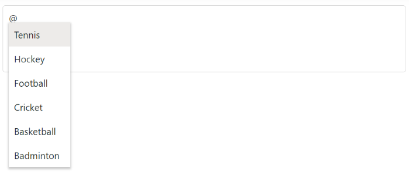

# Sort order type

You can display the suggestion list items in a specific order. It has possible types as `Ascending`, `Descending`, and `None` in the [sortOrder](https://help.syncfusion.com/cr/aspnetmvc-js2/Syncfusion.EJ2.DropDowns.Mention.html#Syncfusion_EJ2_DropDowns_Mention_SortOrder) property.










