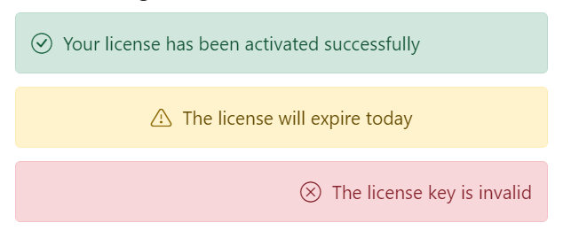
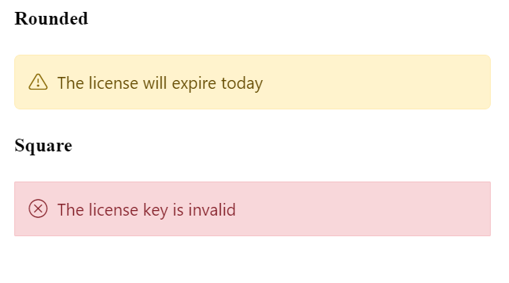

# Customization

The Message control allows you to customize the content display positions and its appearance. This section explains the details about changing the content alignments and border styles for messages.

## Content alignment

Normally, the message content is aligned to the **left**. The Message control allows to align the message content in **center** or **right** through the built-in classes `e-content-center` and `e-content-right`.

The following example demonstrates the message with different content alignments.





















## Rounded and Square

To customize the Message control's appearance, add the custom class to the message through `cssClass` property. This custom class will be added to the root element. Based on this custom class, the user can override the styles of the message at the application level.

The following example shows the rounded and squared appearance of the message, which can be achieved through adding the `cssClass` property.





















## CSS Message

The Essential JS 2 Message has the following predefined classes that can be defined in the HTML elements, which renders the message without any script reference.

| Class | Description |
| -------- | -------- |
| e-message | Represents the message wrapper. |
| e-msg-icon | Represents the severity type icon. |
| e-msg-content | Represents the message content. |
| e-msg-close-icon | Represents the close icon. |
| e-info | Represents the information message. |
| e-success | Represents the success message. |
| e-warning | Represents the warning message. |
| e-error | Represents the error message. |
| e-content-center | Aligns the message content to the center. |
| e-content-right | Aligns the message content to the right. |

The following example shows the message which renders without any script reference.





















