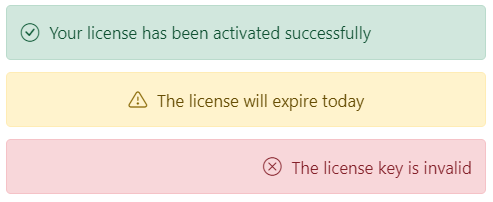
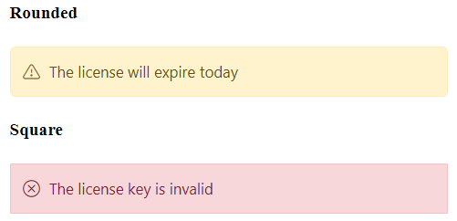

# Customization

The Message can also be customized with its content positions and it appearance.

## Content alignment

The Message content has an different types of alignments such as **Left**, **Right** and **Center**. By default, the message content is aligned to the left. If the user wants to align the content in **Center** or **Right** for their readability, it can be achieved through the built-in classes `e-content-center` and `e-content-right`.

The following example demonstrates the message with different content alignments.





















## Rounded and Square

The following example show the rounded and squared appearance of the message which can be achieved through adding the `cssClass` and customizing the border styles.





















## CSS Message

The Essential JS 2 Message has the following predefined classes that can be defined in the HTML elements which renders the message without any script reference.

| Class | Description |
| -------- | -------- |
| e-message | Used to represent the message styles. |
| e-msg-icon | Used to represent severity type and icon. |
| e-msg-content |  Used to represent the message content. |





















