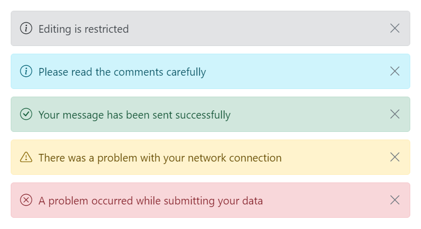
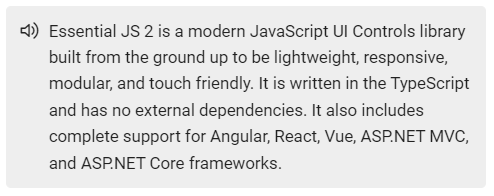

# Icons in Message control

This section explains how to show or hide the close icon and add the custom severity icon to the message.

## Close icon

The message can be rendered with or without the close icon. The close icon is used to hide the message, either by manually clicking the close icon or through keyboard interaction.

By default, the close icon is not rendered in the message. To show the close icon, set the `showCloseIcon` property to `true`.

In the following example, the messages are rendered with the close icon.

The following example demonstrates the message with close icon.





















## Custom icon

By default, the severity icons can be displayed according to the severity type to make the user more understandable by visual information rather than text. If the user wants to customize these icons, then it can be achieved through `cssClass` property.

The following example demonstrates how the default message is rendered with a custom severity icon and custom appearance.





















