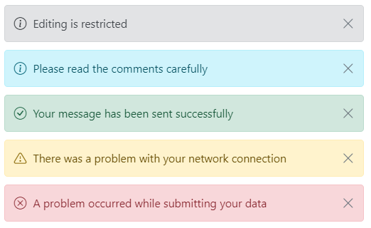

# Icons

The Message has an option to customize the appearance with icons. This section explains about the custom and close icon of the message.

## Close icon

The Message can be rendered with and without the close icon. The close icon is used to hide the message. If the user want to hide the messages after reading it, it can be achieved through these close icon.

To show the close icon in the message, set the `showCloseIcon` property to `true` to make it visible.

The following example demonstrates the message with close icon.





















## Custom icon

By default, the severity icons can be displayed according to the severity type to make the user more understandable by visual information better than text. If the user wants to customize these icons, then it can be achieved through `cssClass` property.

The following example demonstrates the default message is rendered with a custom severity icon and custom appearance.





















