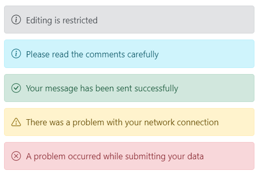
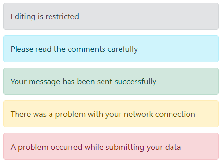

# Severities

This section explains the message with different severity types. The user can displays messages with different severity levels to denote the importance and context of the message based on the `severity` property.

The available severity types are **Normal**, **Success**, **Info**, **Warning** and **Error**. The default severity type for message is **Normal**.

The following example demonstrates the messages with different severity types.





















By default, severity icons can be displayed according to the severity type to make the user more understandable by visual information better than text. If the user does not wants to show the severity icons, it can be removed by setting `false` to `showIcon` property.

The following example demonstrates the different severity messages without the severity icons.





















