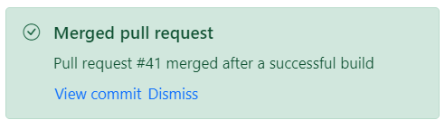

# Template

The message supports templates that allow you to customize the content with a custom structure. The content can be a string, paragraph, or any other HTML element. The template can be rendered through the `content` property or can be added directly to the HTML element.

In the below sample, the Message control content is customized with HTML elements and Syncfusion Button controls, which are directly added to the HTML element.





















