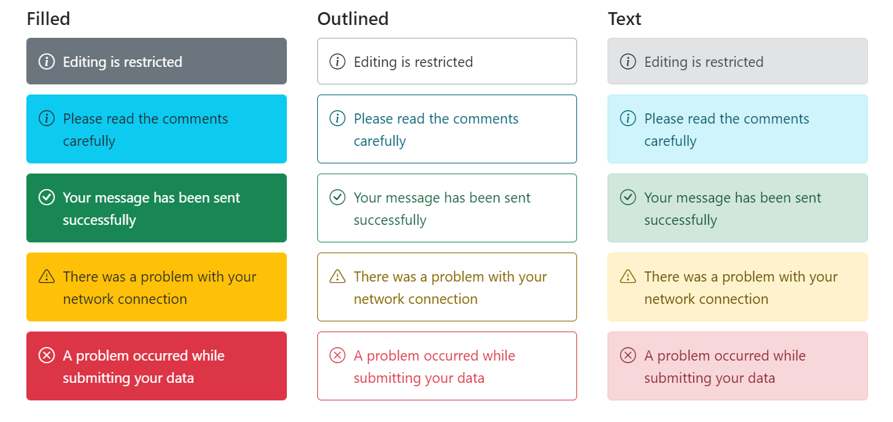

# Variants

The Message has predefined appearance variants for different visual representations. It can be displayed with different appearances based on the `variant` property.

The available variants are **Text**, **Outlined** and **Filled**. The default variant type for message is **Text**.
* **Text** - The severity is differentiated using a text color and a light background color.
* **Outlined** - The severity is differentiated using a text color and a border without background.
* **Filled** - The severity is differentiated using a text color and a dark background color.

The following example demonstrates the default message with different variant types.





















