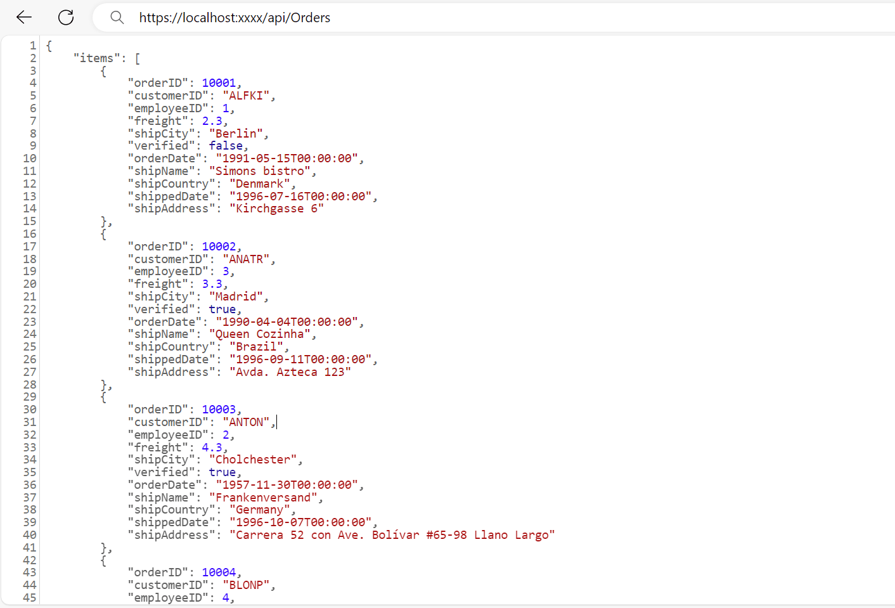
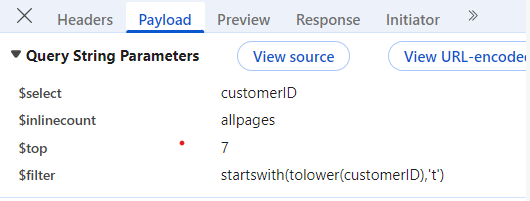

# Data Binding

The MultiSelect loads the data either from local data sources or remote data services using the [dataSource](https://help.syncfusion.com/cr/aspnetcore-js2/Syncfusion.EJ2.DropDowns.MultiSelect.html#Syncfusion_EJ2_DropDowns_MultiSelect_DataSource) property. It supports the data type of `array` or [DataManager](https://help.syncfusion.com/cr/aspnetcore-js2/Syncfusion.Data.html).

The MultiSelect also supports different kinds of data services such as OData, OData V4, and Web API, and data formats such as XML, JSON, and JSONP with the help of [DataManager](https://help.syncfusion.com/cr/aspnetcore-js2/Syncfusion.Data.html) adaptors.

| Fields | Type | Description |
|------|------|-------------|
| text |  `string` | Specifies the display text of each list item. |
| value |  `number or string` | Specifies the hidden data value mapped to each list item that should contain a unique value. |
| groupBy |  `string` | Specifies the category under which the list item has to be grouped. |
| iconCss |  `string` | Specifies the icon class of each list item. |

N> When binding complex data to the MultiSelect, fields should be mapped correctly. Otherwise, the selected item remains undefined.

## Binding local data

Local data can be represented in two ways as described below.

### 1. Array of string

The MultiSelect has support to load array of primitive data such as strings and numbers. Here, both value and text field act the same.

























### 2. Array of object

The MultiSelect can generate its list items through an array of complex data. For this, the appropriate columns should be mapped to the [fields](https://help.syncfusion.com/cr/aspnetcore-js2/Syncfusion.EJ2.DropDowns.MultiSelect.html#Syncfusion_EJ2_DropDowns_MultiSelect_Fields) property.

In the following example, `Id` column and `Game` column from complex data have been mapped to the `value` field and `text` field, respectively.

























### 3. Array of complex object

The MultiSelect can generate its list items through an array of complex data. For this, the appropriate columns should be mapped to the [`fields`](https://help.syncfusion.com/cr/aspnetcore-js2/Syncfusion.EJ2.DropDowns.MultiSelect.html#Syncfusion_EJ2_DropDowns_MultiSelect_Fields) property.

In the following example, `Code.Id` column and `Country.CountryId` column from complex data have been mapped to the `value` field and `text` field, respectively.

























## Binding remote data

The MultiSelect supports retrieval of data from remote data services with the help of `DataManager` control. The `Query` property is used to fetch data from the database and bind it to the MultiSelect.

The following sample displays the first 6 contacts from “Customers” table of the `Northwind` Data Service.

























### Bind to URL Adaptor

The MultiSelect supports retrieval of data from URL adaptor.

























### Web API Adaptor

The `WebApiAdaptor` is an extension of the `ODataAdaptor`, designed to interact with Web APIs created with OData endpoints. This adaptor ensures seamless communication between Syncfusion ASP.NET Core MultiSelect and OData-endpoint based Web APIs, enabling efficient data retrieval and manipulation. For successful integration, the endpoint must be capable of understanding OData-formatted queries sent along with the request.

To enable the OData query option for a Web API, please refer to the corresponding [documentation](https://learn.microsoft.com/en-us/aspnet/web-api/overview/odata-support-in-aspnet-web-api/supporting-odata-query-options), which provides detailed instructions on configuring the endpoint to understand OData-formatted queries.

This section describes a step-by-step process for retrieving data service using `WebApiAdaptor`, then binding it to the MultiSelect to facilitate data and CRUD operations.

#### Creating a Web API Service

To configure a server with Syncfusion ASP.NET Core MultiSelect, follow the steps below:

**1. Project Creation:**

Open Visual Studio and create an ASP.NET Core project named **WebApiAdaptor**. To create an ASP.NET Core application, follow the documentation [link](https://learn.microsoft.com/en-us/aspnet/core/tutorials/razor-pages/razor-pages-start?view=aspnetcore-8.0&tabs=visual-studio#create-a-razor-pages-web-app) for detailed steps.

**2. Model Class Creation:**

Create a model class named `OrdersDetails.cs` inside the **Models** folder on the server-side. This model will represent the order data structure.

```
using System.Linq;

namespace WebApiAdaptor.Models
{
  public class OrdersDetails
  {
    
    public static List<OrdersDetails> order = new List<OrdersDetails>();

    public OrdersDetails()
    {

    }
    public OrdersDetails(int OrderID, string CustomerId, int EmployeeId, double Freight, bool Verified, DateTime OrderDate, string ShipCity, string ShipName, string ShipCountry, DateTime ShippedDate, string ShipAddress)
    {
      this.OrderID = OrderID;
      this.CustomerID = CustomerId;
      this.EmployeeID = EmployeeId;
      this.Freight = Freight;
      this.ShipCity = ShipCity;
      this.Verified = Verified;
      this.OrderDate = OrderDate;
      this.ShipName = ShipName;
      this.ShipCountry = ShipCountry;
      this.ShippedDate = ShippedDate;
      this.ShipAddress = ShipAddress;
    }

    public static List<OrdersDetails> GetAllRecords()
    {
      if (order.Count() == 0)
      {
        int code = 10000;
        for (int i = 1; i <= 2000; i++)
        {
          order.Add(new OrdersDetails(code + 1, "ALFKI", i + 0, 2.3 * i, false, new DateTime(1991, 05, 15), "Berlin", "Simons bistro", "Denmark", new DateTime(1996, 7, 16), "Kirchgasse 6"));
          order.Add(new OrdersDetails(code + 2, "ANATR", i + 2, 3.3 * i, true, new DateTime(1990, 04, 04), "Madrid", "Queen Cozinha", "Brazil", new DateTime(1996, 9, 11), "Avda. Azteca 123"));
          order.Add(new OrdersDetails(code + 3, "ANTON", i + 1, 4.3 * i, true, new DateTime(1957, 11, 30), "Cholchester", "Frankenversand", "Germany", new DateTime(1996, 10, 7), "Carrera 52 con Ave. Bolívar #65-98 Llano Largo"));
          order.Add(new OrdersDetails(code + 4, "BLONP", i + 3, 5.3 * i, false, new DateTime(1930, 10, 22), "Marseille", "Ernst Handel", "Austria", new DateTime(1996, 12, 30), "Magazinweg 7"));
          order.Add(new OrdersDetails(code + 5, "BOLID", i + 4, 6.3 * i, true, new DateTime(1953, 02, 18), "Tsawassen", "Hanari Carnes", "Switzerland", new DateTime(1997, 12, 3), "1029 - 12th Ave. S."));
          code += 5;
        }
      }
      return order;
    }
    [Key]
    public int? OrderID { get; set; }
    public string CustomerID { get; set; }
    public int? EmployeeID { get; set; }
    public double? Freight { get; set; }
    public string ShipCity { get; set; }
    public bool Verified { get; set; }
    public DateTime OrderDate { get; set; }
    public string ShipName { get; set; }
    public string ShipCountry { get; set; }
    public DateTime ShippedDate { get; set; }
    public string ShipAddress { get; set; }
  }
}
```

**3. API Controller Creation:**

Create a file named `OrdersController.cs` under the **Controllers** folder. This controller will handle data communication with the Syncfusion ASP.NET Core MultiSelect. Implement the **Get** method in the controller to return the data as required by `WebApiAdaptor`.
```

using Microsoft.AspNetCore.Http;
using Microsoft.AspNetCore.Mvc;
using WebApiAdaptor.Models;
using System.Linq;

namespace WebApiAdaptor.Controllers
{
    /// <summary>
    /// Retrieves all order records.
    /// </summary>
    /// <returns> Returns an object containing a list of orders and the total count of records. </returns>
    [HttpGet]
    public object Get()
    {
        var data = OrdersDetails.GetAllRecords().ToList();
        return new { Result = data, Count = data.Count() };
    }
}
```

**4: Add ASP.NET Core MultiSelect**



Now, add the Syncfusion ASP.NET Core MultiSelect tag helper in `~/Pages/Index.cshtml` page.

```
<div id='web-data' class='col-lg-6' style='padding-top:15px'>
    <div class='content'>
    <ejs-multiselect id="games" placeholder="Select Country" query="new ej.data.Query().select(['customerID']).take(7).requiresCount()">
        <e-data-manager url="https://localhost:xxxx/api/orders" adaptor="WebApiAdaptor"></e-data-manager>
         <e-multiselect-fields value="customerID" text="customerID"></e-multiselect-fields>
    </ejs-multiselect>
    </div>
</div>
```



```
<div id='web-data' class='col-lg-6' style='padding-top:15px'>
    <div class='content'>
        @Html.EJS().MultiSelect("games").Placeholder("Select customer").DataSource(dataManger =>
            dataManger.Url("https://localhost:xxxx/api/orders").Adaptor("WebApiAdaptor")).Fields(new MultiSelectFieldSettings { Text = "customerID", Value = "customerID" }).Query(new Query().Select("customerID").Take(7).RequiresCount()).Render()
        // Replace `xxxx` with your actual localhost port number.
    </div>
</div>
```


**5. Run the Application:**

Run the application in Visual Studio. It will be accessible on a URL like **https://localhost:xxxx**. 

After running the application, you can verify that the server-side API controller is successfully returning the order data in the URL(https://localhost:xxxx/api/Orders). Here **xxxx** denotes the port number.



#### Handling searching operation

To handle search operation, implement search logic on the server side according to the received OData-formatted query.



**OrdersController.cs**
```
// GET: api/Orders
[HttpGet]
 public object Get()
 {
     var queryString = Request.Query;
     var data = OrdersDetails.GetAllRecords().ToList();
     string filter = queryString["$filter"];

     if (filter != null)
     {
         var filters = filter.Split(new string[] { " and " }, StringSplitOptions.RemoveEmptyEntries);
         foreach (var filterItem in filters)
         {
             if (filterItem.Contains("substringof"))
             {
                 // Perform Searching.
                 var searchParts = filterItem.Split('(', ')', '\'');
                 var searchValue = searchParts[3];

                 // Apply the search value to all searchable fields.
                 data = data.Where(cust =>
                   cust.OrderID.ToString().Contains(searchValue) ||
                   cust.CustomerID.ToLower().Contains(searchValue) ||
                   cust.ShipCity.ToLower().Contains(searchValue) ||
                   cust.ShipCountry.ToLower().Contains(searchValue)
                 // Add conditions for other searchable fields as needed.
                 ).ToList();
             }
             else
             {
                 // Perform filtering.
                 var searchParts = filterItem.Split('(', ')', '\'');
                 var searchValue = searchParts[4];

                 // Apply the search value to all searchable fields.
                 data = data.Where(cust =>
                   cust.OrderID.ToString().Contains(searchValue) ||
                   cust.CustomerID.ToLower().Contains(searchValue) ||
                   cust.ShipCity.ToLower().Contains(searchValue) ||
                   cust.ShipCountry.ToLower().Contains(searchValue)
                 // Add conditions for other searchable fields as needed.
                 ).ToList();
             }
         }

     }
     return new { result = data, count = data.Count() };
 }
```
**Index.cshtml**
```
// Replace `xxxx` with your actual localhost port number.
<div id='web-data' class='col-lg-6' style='padding-top:15px'>
    <div class='content'>
        <ejs-multiselect id="games" placeholder="Select Country" query="new ej.data.Query().select(['customerID']).take(7).requiresCount()" allowFiltering="true">
            <e-data-manager url="https://localhost:44347/api/orders" adaptor="WebApiAdaptor"></e-data-manager>
            <e-multiselect-fields value="customerID" text="customerID"></e-multiselect-fields>
        </ejs-multiselect>
    </div>
</div>
```

### Binding with OData services

The `ODataV4Adaptor` in the Syncfusion<sup style="font-size:70%">&reg;</sup> MultiSelect Control allows seamless integration of the MultiSelect with OData v4 services, enabling efficient data fetching and manipulation. This guide provides detailed instructions on binding data using the `ODataV4Adaptor` in your Syncfusion<sup style="font-size:70%">&reg;</sup> MultiSelect Control.

#### Creating an ODataV4 service

To configure a server with Syncfusion<sup style="font-size:70%">&reg;</sup> MultiSelect, you need to follow the below steps:

**Step 1:** Set Up Your Development Environment

Before you start, make sure you have the following installed:

- .NET Core SDK
- Node.js
- Visual Studio or any other preferred code editor

**Step 2:** Create a New ASP.NET Core Project

Open Visual Studio and create an ASP.NET Core Web API project named **ODataV4Adaptor**.

**Step 3:** Install NuGet Packages

Using the NuGet package manager in Visual Studio (Tools → NuGet Package Manager → Manage NuGet Packages for Solution), install the **Microsoft.AspNetCore.OData** NuGet package.

**Step 4:** Add the Microsoft.TypeScript.MSBuild NuGet package to the project:

Using the NuGet package manager in Visual Studio (Tools → NuGet Package Manager → Manage NuGet Packages for Solution), install the [Microsoft.TypeScript.MSBuild](https://www.nuget.org/packages/Microsoft.TypeScript.MSBuild/) NuGet package.

**Step 5:** Configure the server

In the `Program.cs` file of your project, configure the server to serve static files by adding the following code:

```cs
var app = builder.Build();

app.UseDefaultFiles();
app.UseStaticFiles();
```

Comment out the below line in `launchSettings.json`:

```json
    "https": {
      "commandName": "Project",
      "dotnetRunMessages": true,
      "launchBrowser": true,
     // "launchUrl": "swagger",
      "applicationUrl": "https://localhost:xxxx;http://localhost:xxxx",
      "environmentVariables": {
        "ASPNETCORE_ENVIRONMENT": "Development"
      }
    },
```
This configuration enables the server to locate and serve the `index.html` file.

**Step 6:** Model Class Creation

Create a model class named **OrdersDetails.cs** in the server-side **Models** folder to represent the order data.




using System.ComponentModel.DataAnnotations;

namespace ODataV4Adaptor.Models
{
 public class OrdersDetails
    {
        public static List<OrdersDetails> order = new List<OrdersDetails>();
        public OrdersDetails()
        {

        }
        public OrdersDetails(
        int OrderID, string CustomerId, int EmployeeId, string ShipCountry)
        {
            this.OrderID = OrderID;
            this.CustomerID = CustomerId;
            this.EmployeeID = EmployeeId;
            this.ShipCountry = ShipCountry;
        }

        public static List<OrdersDetails> GetAllRecords()
        {
            if (order.Count() == 0)
            {
                int code = 10000;
                for (int i = 1; i < 10; i++)
                {
                    order.Add(new OrdersDetails(code + 1, "ALFKI", i + 0,  "Denmark"));
                    order.Add(new OrdersDetails(code + 2, "ANATR", i + 2, "Brazil"));
                    order.Add(new OrdersDetails(code + 3, "ANTON", i + 1, "Germany"));
                    order.Add(new OrdersDetails(code + 4, "BLONP", i + 3, "Austria"));
                    order.Add(new OrdersDetails(code + 5, "BOLID", i + 4, "Switzerland"));
                    code += 5;
                }
            }
            return order;
        }
        [Key]
        public int? OrderID { get; set; }
        public string? CustomerID { get; set; }
        public int? EmployeeID { get; set; }
        public string? ShipCountry { get; set; }
    }
}




**Step 7:** Build the Entity Data Model

To construct the Entity Data Model for your ODataV4 service, utilize the `ODataConventionModelBuilder` to define the model's structure. Start by creating an instance of the `ODataConventionModelBuilder`, then register the entity set **Orders** using the `EntitySet<T>` method, where `OrdersDetails` represents the CLR type containing order details. 

```cs
[program.cs]
using Microsoft.OData.ModelBuilder;

// Create an ODataConventionModelBuilder to build the OData model
var modelBuilder = new ODataConventionModelBuilder();

// Register the "Orders" entity set with the OData model builder
modelBuilder.EntitySet<OrdersDetails>("Orders");
```

**Step 8:** Register the ODataV4 Services

Once the Entity Data Model is built, you need to register the ODataV4 services in your ASP.NET Core application. Here's how:

```cs
[program.cs]

// Add controllers with OData support to the service collection
builder.Services.AddControllers().AddOData(
    options => options
        .Count()
        .AddRouteComponents("odata", modelBuilder.GetEdmModel()));
```
**Step 9:** Add controllers

Finally, add controllers to expose the OData endpoints. Here's an example:

```cs
using Microsoft.AspNetCore.Mvc;
using Microsoft.AspNetCore.OData.Query;
using ODataV4Adaptor.Server.Models;

namespace ODataV4Adaptor.Controllers
{
    [Route("[controller]")]
    [ApiController]
    public class OrdersController : ControllerBase
    {
        /// <summary>
        /// Retrieves all orders.
        /// </summary>
        /// <returns>The collection of orders.</returns>
        [HttpGet]
        [EnableQuery]
        public IActionResult Get()
        {
            var data = OrdersDetails.GetAllRecords().AsQueryable();
            return Ok(data);
        }
    }
}
```
**Step 10: Add ASP.NET Core MultiSelect**



Now, add the Syncfusion ASP.NET Core MultiSelect tag helper in `~/Pages/Index.cshtml` page.

```
<div id='web-data' class='col-lg-6' style='padding-top:15px'>
    <div class='content'>
    <ejs-multiselect id="games" placeholder="Select Country" query="new ej.data.Query().select(['customerID']).take(7).requiresCount()">
        <e-data-manager url="https://localhost:xxxx/api/orders" adaptor="ODataV4Adaptor"></e-data-manager>
         <e-multiselect-fields value="customerID" text="customerID"></e-multiselect-fields>
    </ejs-multiselect>
    </div>
</div>
```



```
<div id='web-data' class='col-lg-6' style='padding-top:15px'>
    <div class='content'>
        @Html.EJS().MultiSelect("games").Placeholder("Select customer").DataSource(dataManger =>
            dataManger.Url("https://localhost:xxxx/api/orders").Adaptor("ODataV4Adaptor")).Fields(new MultiSelectFieldSettings { Text = "customerID", Value = "customerID" }).Query(new Query().Select("customerID").Take(7).RequiresCount()).Render()
        // Replace `xxxx` with your actual localhost port number.
    </div>
</div>
```


**Step 11:** Run the Application 

Run the application in Visual Studio. It will be accessible on a URL like **https://localhost:xxxx**. 

After running the application, you can verify that the server-side API controller is successfully returning the order data in the URL(https://localhost:xxxx/odata/Orders). Here **xxxx** denotes the port number.

### Offline mode

To avoid post back for every action, set the MultiSelect to load all data on initialization and make the actions process in client-side. To enable this behavior, use the `Offline` property of `DataManager`.

The following example for remote data binding and enabled offline mode.

























## See Also

* [How to load data using template](https://ej2.syncfusion.com/aspnetmvc/documentation/multi-select/templates#item-template)
* [How to group the data using header](https://ej2.syncfusion.com/aspnetmvc/documentation/multi-select/grouping)
* [How to filter the bound data](https://ej2.syncfusion.com/aspnetmvc/documentation/multi-select/templates)
