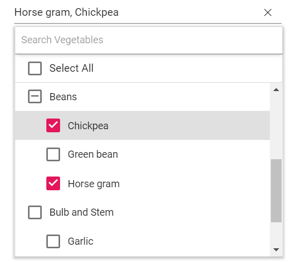

# Grouping

The MultiSelect supports wrapping nested elements into a group based on different categories. The category
of each list item can be mapped through the [groupBy](https://help.syncfusion.com/cr/cref_files/aspnetcore-js2/Syncfusion.EJ2~Syncfusion.EJ2.DropDowns.MultiSelectFieldSettings~GroupBy.html) field in
the data table. The group header is displayed both as inline and fixed headers. The fixed group header content
is updated dynamically on scrolling the popup list with its category value.

In the following sample, vegetables are grouped according on its category using `groupBy` field.
























## Customization

The grouping header is also provided with customization option. This allows custom designing using the `groupTemplate` property for both inline and fixed headers as referred here:
[Group Template support to MultiSelect](./templates).

## Grouping with CheckBox

Previously, there is no checkbox for group headers. Now, this feature allow to render checkbox in group header to select the group items in single selection. You can enable this feature by setting [`enableGroupCheckBox`](https://help.syncfusion.com/cr/cref_files/aspnetcore-js2/Syncfusion.EJ2~Syncfusion.EJ2.DropDowns.MultiSelect~EnableGroupCheckBox.html) property value as **true** and **mode** property as **CheckBox**.

Inject the `CheckBoxSelection` module in the MultiSelect to use the checkbox.
























Output be like the below:

