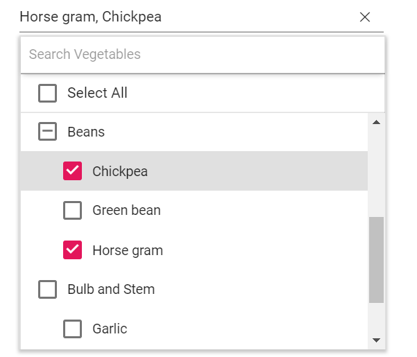

# Grouping MultiSelect items

The MultiSelect supports grouping list items by category. The category of each list item can be mapped through the [groupBy](https://help.syncfusion.com/cr/aspnetcore-js2/Syncfusion.EJ2.DropDowns.MultiSelectFieldSettings.html#Syncfusion_EJ2_DropDowns_MultiSelectFieldSettings_GroupBy) field in the data table. The group header is displayed as both inline and fixed headers. The fixed group header content is updated dynamically as the popup list scrolls, showing the current category.

In the following sample, vegetables are grouped by their category using the `groupBy` field.
























## Customization

The grouping header supports customization. You can design custom inline or fixed headers by using the `groupTemplate` property, as described in [Group Template support for MultiSelect](./templates).

## Grouping with checkbox

Earlier releases did not provide a checkbox in group headers. With this feature, you can render a checkbox in the group header to select all items in the group in a single selection. Enable this feature by setting the [`enableGroupCheckBox`](https://help.syncfusion.com/cr/aspnetcore-js2/Syncfusion.EJ2.DropDowns.MultiSelect.html#Syncfusion_EJ2_DropDowns_MultiSelect_EnableGroupCheckBox) property to `true` and the `mode` property to `CheckBox`.

Inject the `CheckBoxSelection` module into the MultiSelect to use the checkbox.
























Output be like the below:

