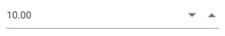

# Accessibility

The NumericTextBox characterized with complete ARIA Accessibility support which helps to accessible
by on-screen readers and other assistive technology devices. This component designed with the
reference of the guidelines document given in [WAI ARAI Accessibility practices](http://www.w3.org/TR/wai-aria-practices-1.1/#spinbutton).

The NumericTextBox uses the `spinbutton` role and following ARIA properties to its element based on its state.

| **Property** | **Functionality** |
| --- | --- |
| aria-live | The `aria-live` attribute indicates the priority of updates to a live region |
| aria-valuemin | The `aria-valuemin` property specifies the minimum allowable range of the NumericTextBox.|
| aria-valuemax | The `aria-valuemax` property specifies the maximum allowable range of the NumericTextBox. |
| aria-disabled | The `aria-disabled` property indicates disabled state of the NumericTextBox. |
| aria-readonly | The `aria-readonly` property indicates the read-only state of the NumericTextBox. |
| aria-valuenow | The `aria-valuenow` property specifies the current value of the NumericTextBox. |
| aria-invalid | The `aria-invalid` property indicates that the user input is incorrect or not within acceptable ranges. |
| aria-label | The `aria-label` property indicates a string value that labels the NumericTextBox. |

## Keyboard interaction

Keyboard interaction of the NumericTextBox control has been designed based on
[WAI-ARIA Practices](http://www.w3.org/TR/wai-aria-practices-1.1/#spinbutton) described for the NumericTextBox and
it is an alternative to mouse actions to interact with the NumericTextBox.

The below table shows shortcut keys and its corresponding usage.

| **Keyboard shortcuts** | **Actions** |
| --- | --- |
| <kbd>Arrow Down</kbd> | Increments the value. |
| <kbd>Arrow Up</kbd> | Decrements the value |
























Output be like the below.

