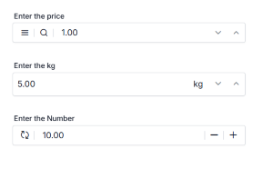

# Adornments in ##Platform_Name## NumericTextBox control

Adornments enhance the numeric textbox by adding custom elements such as currency symbols, unit labels, or action icons before or after the input field. This feature provides a flexible way to extend numeric textbox functionality with visual context or interactive elements for improved user experience and input clarity.

## Overview

Adornments are useful for:
- **Currency Symbols**: Adding currency indicators ($, €, ¥, etc.) to monetary inputs
- **Unit Labels**: Displaying measurement units (kg, m, cm, km, etc.)
- **Decimal Indicators**: Showing decimal points or precision information
- **Action Icons**: Including buttons for increment, decrement, reset, or clear operations
- **Visual Context**: Adding icons that indicate the input type or purpose
- **Input Validation**: Displaying validation status or range indicators
- **Improved Clarity**: Providing visuals to guide user input and enhance discoverability

## Add adornments to numeric textbox

Adornments are added using the [prependTemplate](../api/numerictextbox) and [appendTemplate](../api/numerictextbox) properties. These properties accept HTML content that renders before and after the numeric input field respectively, enabling flexible customization without modifying the core numeric textbox structure.

**Prepend Adornments (Prefix)**: Displayed at the beginning of the numeric textbox (left side for LTR layouts)  
**Append Adornments (Suffix)**: Displayed at the end of the numeric textbox (right side for LTR layouts)

### Basic implementation


















Output be like the below.

