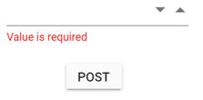

# NumericTextBoxFor and Model Binding

This section demonstrates the Strongly typed extension support in NumericTextBox. The view which bind with any model is called as
strongly typed view. You can bind any class as model to view.
You can access model properties on that view. You can use data associated with model to render controls.

In this sample, first click the submit button to post the selected value in the MaskedTextBox. When posting the null value,
validation error message will be shown below the NumericTextBox.
























Output be like the below.

