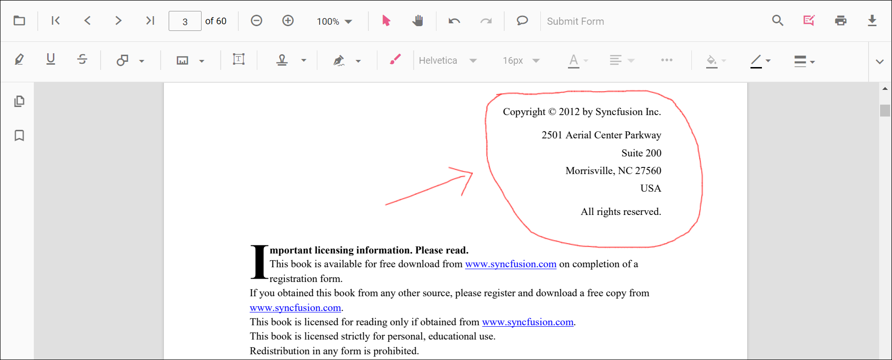
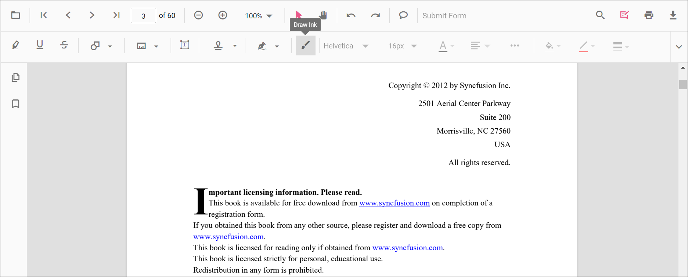
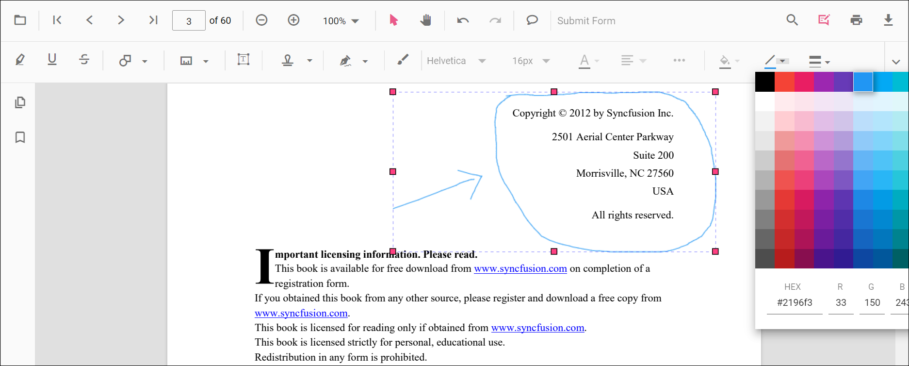
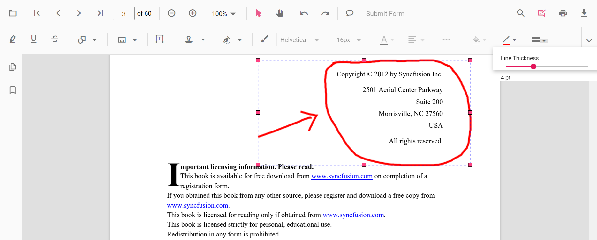
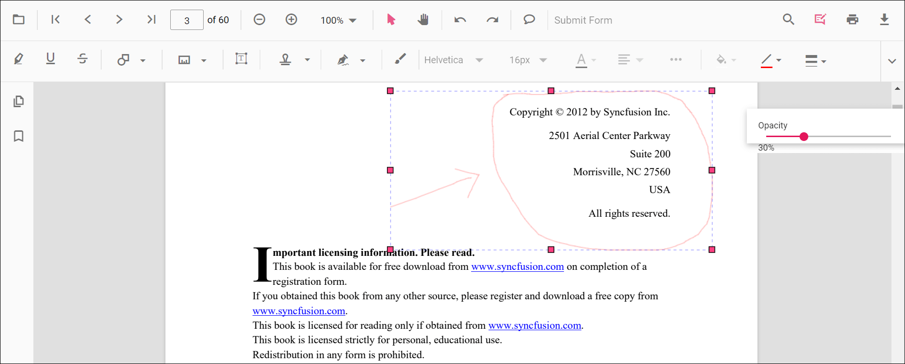

# Ink Annotation in the ASP.NET MVC PDF Viewer component

The PDF Viewer control provides the options to add, edit, and delete the ink annotations.



## Adding an ink annotation to the PDF document

The ink annotations can be added to the PDF document using the annotation toolbar.

* Click the **Edit Annotation** button in the PDF Viewer toolbar. A toolbar appears below it.
* Select the **Draw Ink** button in the annotation toolbar. It enables the ink annotation mode.
* You can draw anything over the pages of the PDF document.



Refer to the following code sample to switch to the ink annotation mode.

```html
    <!--Element to set ink annotation mode-->
    <button id="set" onclick="addAnnot()">Draw Ink</button>
    <div style="width:100%;height:600px">
        @Html.EJS().PdfViewer("pdfviewer").ServiceUrl(VirtualPathUtility.ToAbsolute("~/PdfViewer/")).DocumentPath("PDF_Succinctly.pdf").Render()
    </div>
    <script>
        function addAnnot() {
            var pdfViewer = document.getElementById('pdfviewer').ej2_instances[0];
            pdfViewer.annotation.setAnnotationMode('Ink');
        }
    </script>
```

## Editing the properties of the ink annotation

The stroke color, thickness, and opacity of the ink annotation can be edited using the Edit stroke color tool, Edit thickness tool, and Edit opacity tool in the annotation toolbar.

### Editing stroke color

The stroke color of the annotation can be edited using the color palette provided in the Edit Stroke Color tool.



### Editing thickness

The thickness of the border of the annotation can be edited using the range slider provided in the Edit Thickness tool.



### Editing opacity

The opacity of the annotation can be edited using the range slider provided in the Edit Opacity tool.

