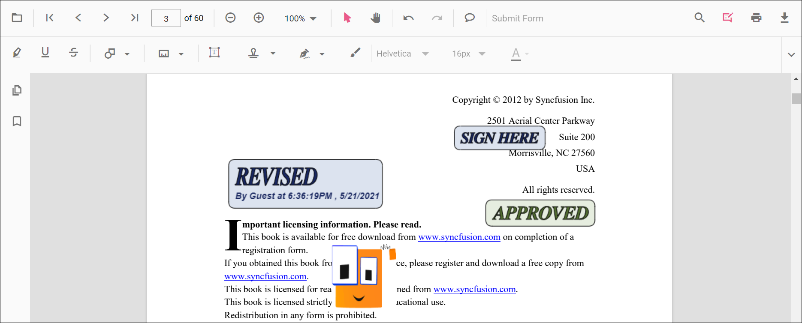
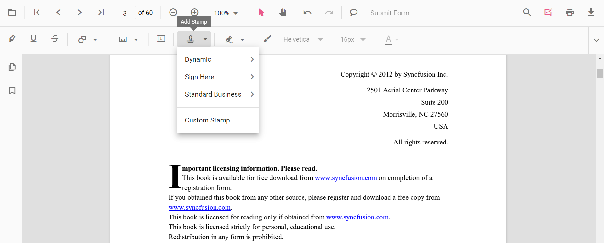
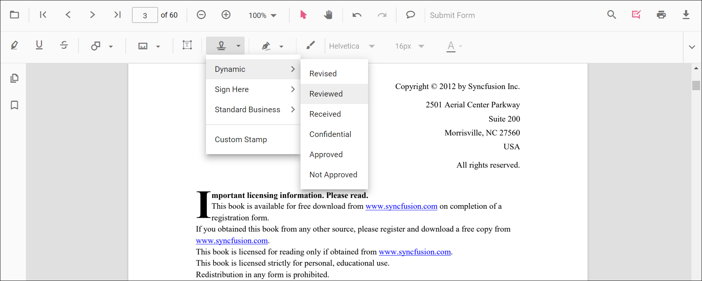
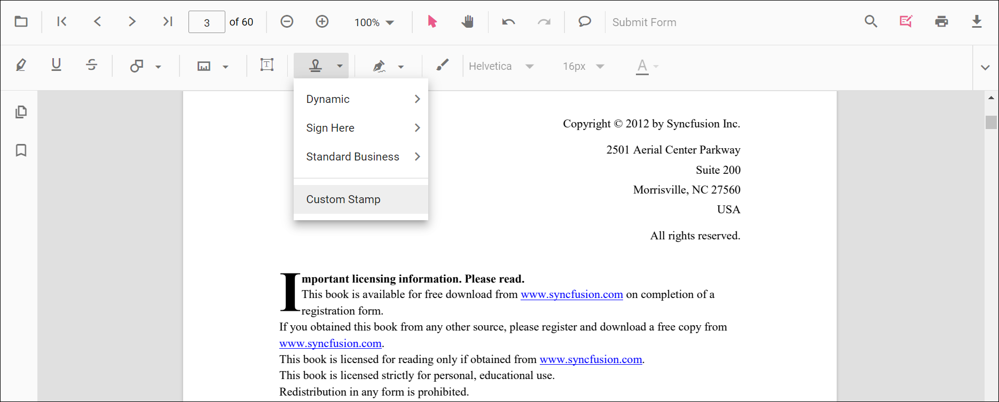

# Stamp Annotation in the ASP.NET MVC PDF Viewer component

The PDF Viewer control provides options to add, edit, delete, and rotate the following stamp annotation in the PDF documents:

* Dynamic
* Sign Here
* Standard Business
* Custom Stamp



## Adding stamp annotations to the PDF document

The stamp annotations can be added to the PDF document using the annotation toolbar.

* Click the **Edit Annotation** button in the PDF Viewer toolbar. A toolbar appears below it.
* Click the **Stamp Annotation** drop-down button. A drop-down pop-up will appear and shows the stamp annotations to be added.



* Select the annotation type to be added to the page in the pop-up.



* You can add the annotation over the pages of the PDF document.

In the pan mode, if the stamp annotation mode is entered, the PDF Viewer control will switch to text select mode.

## Adding custom stamp to the PDF document

* Click the **Edit Annotation** button in the PDF Viewer toolbar. A toolbar appears below it.
* Click the **Stamp Annotation** drop-down button. A drop-down pop-up will appear and shows the stamp annotations to be added.
* Click the Custom Stamp button.



* The file explorer dialog will appear, choose the image and then add the image to the PDF page.

>The JPG and JPEG image format is only supported in the custom stamp annotations.

## Setting default properties during control initialization

The properties of the stamp annotation can be set before creating the control using the StampSettings.

After editing the default opacity using the Edit Opacity tool, they will be changed to the selected values.
Refer to the following code sample to set the default sticky note annotation settings.

```html
    <div style="width:100%;height:600px">
        @Html.EJS().PdfViewer("pdfviewer").ServiceUrl(VirtualPathUtility.ToAbsolute("~/PdfViewer/")).DocumentPath("PDF_Succinctly.pdf").StampSettings(new Syncfusion.EJ2.PdfViewer.PdfViewerStampSettings { Opacity = 0.3, Author = "Guest User" }).Render()
    </div>
```