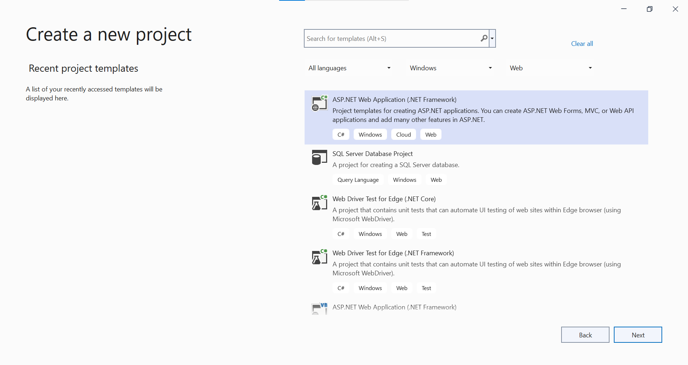
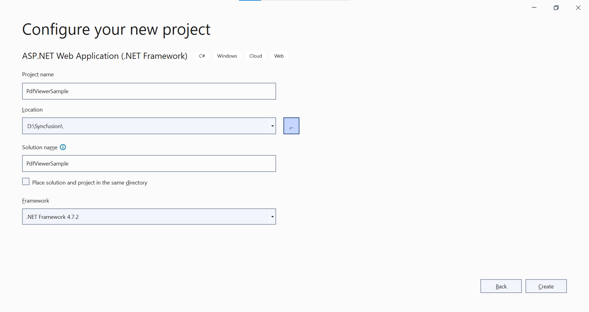
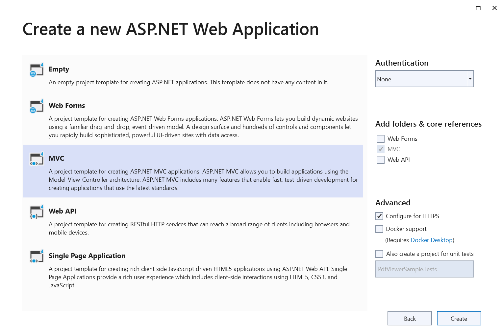
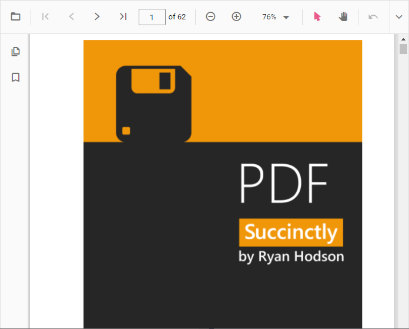

# Getting Started with ASP.NET MVC PDF Viewer Control

The [ASP.NET MVC PDF Viewer](https://www.syncfusion.com/aspnet-mvc-ui-controls/pdf-viewer) control is used to viewing and printing PDF files in any web application. It provides the best viewing experience available with core interactions such as zooming, scrolling, text searching, text selection, and text copying. Thumbnail, bookmark, hyperlink and table of contents support provides easy navigation within and outside the PDF files. 

This section briefly explains about how to integrate ASP.NET MVC PDF Viewer control in your ASP.NET MVC application using Visual Studio.

## Prerequisites

[System requirements for ASP.NET MVC controls](https://ej2.syncfusion.com/aspnetmvc/documentation/system-requirements)

## Integrate PDF Viewer into an ASP.NET MVC application

1. Start Visual Studio and select **Create a new project**. 
2. Create a new ASP.NET MVC Web Application project. 

3. Choose the target framework. 

4. Select Web Application pattern (MVC) for the project and then select **Create** button. 


## ASP.NET MVC PDF Viewer NuGet packages installation

To add .NET PDF Viewer control, the following NuGet packages need to be installed in your ASP.NET MVC application.

* [Syncfusion.EJ2.PdfViewer.AspNet.Mvc5](https://www.nuget.org/packages/Syncfusion.EJ2.PdfViewer.AspNet.Mvc5/)
* [Syncfusion.EJ2.MVC5](https://www.nuget.org/packages/Syncfusion.EJ2.MVC5)

N> If you creating ASP.NET MVC application with MVC4 package, search for [Syncfusion.EJ2.MVC4](https://www.nuget.org/packages/Syncfusion.EJ2.MVC4) and then install it. 

## Add namespace

Add **Syncfusion.EJ2** namespace reference in `Web.config` under `Views` folder.

```
<namespaces>
    <add namespace="Syncfusion.EJ2"/>
</namespaces>
```

## Add style sheet

The theme is referred using CDN inside the `<head>` of `~/Views/Shared/_Layout.cshtml` file as follows,




<head>
    ...
    <!-- Syncfusion ASP.NET MVC controls styles -->
    <link rel="stylesheet" href="https://cdn.syncfusion.com/ej2/{{ site.ej2version }}/fluent.css" />
</head>




N> Checkout the [Themes topic](https://ej2.syncfusion.com/aspnetmvc/documentation/appearance/theme) to learn different ways (CDN, NPM package, and [CRG](https://ej2.syncfusion.com/aspnetmvc/documentation/common/custom-resource-generator)) to refer styles in ASP.NET MVC application, and to have the expected appearance for Syncfusion ASP.NET MVC controls.

## Add script reference

In this getting started walk-through, the required scripts are referred using CDN inside the `<head>` of `~/Views/Shared/_Layout.cshtml` file as follows,




<head>
    ...
    <!-- Syncfusion ASP.NET MVC controls scripts -->
    <script src="https://cdn.syncfusion.com/ej2/{{ site.ej2version }}/dist/ej2.min.js"></script>
</head>




## Register Syncfusion Script Manager

Open `~/Views/Shared/_Layout.cshtml` page and register the script manager `EJS().ScriptManager()` at the end of `<body>` in the ASP.NET MVC application as follows. 




<body>
...
    <!-- Syncfusion ASP.NET MVC Script Manager -->
    @Html.EJS().ScriptManager()
</body>




## Add ASP.NET MVC PDFViewer control

Now, add the Syncfusion ASP.NET MVC PDFViewer control in `~/Views/Home/Index.cshtml` page. You can load a PDF file in the PDF Viewer by specifying the document name in the DocumentPath property as below.




@{
    ViewBag.Title = "Home Page";
}

<div>
    <div style="height:500px;width:100%;">
        @Html.EJS().PdfViewer("pdfviewer").ServiceUrl(VirtualPathUtility.ToAbsolute("~/Home/")).DocumentPath("PDF-Succinctly.pdf").Render()
    </div>
</div>




Add the below code in the `HomeController.cs` file which is placed inside `Controllers` folder.




using Newtonsoft.Json;
using Syncfusion.EJ2.PdfViewer;
using System;
using System.Collections.Generic;
using System.IO;
using System.Linq;
using System.Net;
using System.Net.Http;
using System.Reflection;
using System.Web;
using System.Web.Mvc;

namespace GettingStartedMVC.Controllers
{
    public class HomeController : Controller
    {
        [System.Web.Mvc.HttpPost]
        public ActionResult Load(jsonObjects jsonObject)
        {
            PdfRenderer pdfviewer = new PdfRenderer();
            MemoryStream stream = new MemoryStream();
            var jsonData = JsonConverter(jsonObject);
            object jsonResult = new object();
            if (jsonObject != null && jsonData.ContainsKey("document"))
            {
                if (bool.Parse(jsonData["isFileName"]))
                {
                    string documentPath = GetDocumentPath(jsonData["document"]);

                    if (!string.IsNullOrEmpty(documentPath))
                    {
                        byte[] bytes = System.IO.File.ReadAllBytes(documentPath);
                        stream = new MemoryStream(bytes);

                    }
                    else
                    {
                        string fileName = jsonData["document"].Split(new string[] { "://" }, StringSplitOptions.None)[0];
                        if (fileName == "http" || fileName == "https")
                        {
                            var WebClient = new WebClient();
                            byte[] pdfDoc = WebClient.DownloadData(jsonData["document"]);
                            stream = new MemoryStream(pdfDoc);
                        }
                        else
                        {
                            return this.Content(jsonData["document"] + " is not found");
                        }

                    }
                }
                else
                {
                    byte[] bytes = Convert.FromBase64String(jsonData["document"]);
                    stream = new MemoryStream(bytes);

                }
            }
            jsonResult = pdfviewer.Load(stream, jsonData);
            return Content(JsonConvert.SerializeObject(jsonResult));
        }

        public Dictionary<string, string> JsonConverter(jsonObjects results)
        {
            Dictionary<string, object> resultObjects = new Dictionary<string, object>();
            resultObjects = results.GetType().GetProperties(BindingFlags.Instance | BindingFlags.Public)
                .ToDictionary(prop => prop.Name, prop => prop.GetValue(results, null));
            var emptyObjects = (from kv in resultObjects
                                where kv.Value != null
                                select kv).ToDictionary(kv => kv.Key, kv => kv.Value);
            Dictionary<string, string> jsonResult = emptyObjects.ToDictionary(k => k.Key, k => k.Value.ToString());
            return jsonResult;
        }

        [System.Web.Mvc.HttpPost]
        public ActionResult ExportAnnotations(jsonObjects jsonObject)
        {
            PdfRenderer pdfviewer = new PdfRenderer();
            var jsonData = JsonConverter(jsonObject);
            string jsonResult = pdfviewer.ExportAnnotation(jsonData);
            return Content((jsonResult));
        }

        [System.Web.Mvc.HttpPost]
        public ActionResult ImportAnnotations(jsonObjects jsonObject)
        {
            PdfRenderer pdfviewer = new PdfRenderer();
            string jsonResult = string.Empty;
            var jsonData = JsonConverter(jsonObject);
            if (jsonObject != null && jsonData.ContainsKey("fileName"))
            {
                string documentPath = GetDocumentPath(jsonData["fileName"]);
                if (!string.IsNullOrEmpty(documentPath))
                {
                    jsonResult = System.IO.File.ReadAllText(documentPath);
                }
                else
                {
                    return this.Content(jsonData["document"] + " is not found");
                }
            }
            return Content(JsonConvert.SerializeObject(jsonResult));
        }

        [System.Web.Mvc.HttpPost]
        public ActionResult ImportFormFields(jsonObjects jsonObject)
        {

            PdfRenderer pdfviewer = new PdfRenderer();
            var jsonData = JsonConverter(jsonObject);
            object jsonResult = pdfviewer.ImportFormFields(jsonData);
            return Content(JsonConvert.SerializeObject(jsonResult));
        }

        [System.Web.Mvc.HttpPost]
        public ActionResult ExportFormFields(jsonObjects jsonObject)
        {

            PdfRenderer pdfviewer = new PdfRenderer();
            var jsonData = JsonConverter(jsonObject);
            string jsonResult = pdfviewer.ExportFormFields(jsonData);

            return Content(jsonResult);

        }

        [System.Web.Mvc.HttpPost]
        public ActionResult RenderPdfPages(jsonObjects jsonObject)
        {
            PdfRenderer pdfviewer = new PdfRenderer();
            var jsonData = JsonConverter(jsonObject);
            object jsonResult = pdfviewer.GetPage(jsonData);
            return Content(JsonConvert.SerializeObject(jsonResult));
        }

        [System.Web.Mvc.HttpPost]
        public ActionResult Unload(jsonObjects jsonObject)
        {
            PdfRenderer pdfviewer = new PdfRenderer();
            var jsonData = JsonConverter(jsonObject);
            pdfviewer.ClearCache(jsonData);
            return this.Content("Document cache is cleared");
        }

        [System.Web.Mvc.HttpPost]
        public ActionResult RenderThumbnailImages(jsonObjects jsonObject)
        {
            PdfRenderer pdfviewer = new PdfRenderer();
            var jsonData = JsonConverter(jsonObject);
            object result = pdfviewer.GetThumbnailImages(jsonData);
            return Content(JsonConvert.SerializeObject(result));
        }

        [System.Web.Mvc.HttpPost]
        public ActionResult Bookmarks(jsonObjects jsonObject)
        {
            PdfRenderer pdfviewer = new PdfRenderer();
            var jsonData = JsonConverter(jsonObject);
            object jsonResult = pdfviewer.GetBookmarks(jsonData);
            return Content(JsonConvert.SerializeObject(jsonResult));
        }

        [System.Web.Mvc.HttpPost]
        public ActionResult RenderAnnotationComments(jsonObjects jsonObject)
        {
            PdfRenderer pdfviewer = new PdfRenderer();
            var jsonData = JsonConverter(jsonObject);
            object jsonResult = pdfviewer.GetAnnotationComments(jsonData);
            return Content(JsonConvert.SerializeObject(jsonResult));
        }

        [System.Web.Mvc.HttpPost]
        public ActionResult Download(jsonObjects jsonObject)
        {
            PdfRenderer pdfviewer = new PdfRenderer();
            var jsonData = JsonConverter(jsonObject);
            string documentBase = pdfviewer.GetDocumentAsBase64(jsonData);
            return Content(documentBase);
        }

        [System.Web.Mvc.HttpPost]
        public ActionResult PrintImages(jsonObjects jsonObject)
        {
            PdfRenderer pdfviewer = new PdfRenderer();
            var jsonData = JsonConverter(jsonObject);
            object pageImage = pdfviewer.GetPrintImage(jsonData);
            return Content(JsonConvert.SerializeObject(pageImage));
        }

        private HttpResponseMessage GetPlainText(string pageImage)
        {
            var responseText = new HttpResponseMessage(HttpStatusCode.OK);
            responseText.Content = new StringContent(pageImage, System.Text.Encoding.UTF8, "text/plain");
            return responseText;
        }

        private string GetDocumentPath(string document)
        {
            string documentPath = string.Empty;
            if (!System.IO.File.Exists(document))
            {
                var path = HttpContext.Request.PhysicalApplicationPath;
                if (System.IO.File.Exists(path + "App_Data\\" + document))
                    documentPath = path + "App_Data\\" + document;
            }
            else
            {
                documentPath = document;
            }
            return documentPath;
        }
        public ActionResult Index()
        {
            return View();
        }

        public ActionResult About()
        {
            ViewBag.Message = "Your application description page.";

            return View();
        }

        public ActionResult Contact()
        {
            ViewBag.Message = "Your contact page.";

            return View();
        }
    }
    public class jsonObjects
    {
        public string document { get; set; }
        public string password { get; set; }
        public string zoomFactor { get; set; }
        public string isFileName { get; set; }
        public string xCoordinate { get; set; }
        public string yCoordinate { get; set; }
        public string pageNumber { get; set; }
        public string documentId { get; set; }
        public string hashId { get; set; }
        public string sizeX { get; set; }
        public string sizeY { get; set; }
        public string startPage { get; set; }
        public string endPage { get; set; }
        public string stampAnnotations { get; set; }
        public string textMarkupAnnotations { get; set; }
        public string stickyNotesAnnotation { get; set; }
        public string shapeAnnotations { get; set; }
        public string measureShapeAnnotations { get; set; }
        public string action { get; set; }
        public string pageStartIndex { get; set; }
        public string pageEndIndex { get; set; }
        public string fileName { get; set; }
        public string elementId { get; set; }
        public string pdfAnnotation { get; set; }
        public string importPageList { get; set; }
        public string uniqueId { get; set; }
        public string data { get; set; }
        public string viewPortWidth { get; set; }
        public string viewportHeight { get; set; }
        public string tilecount { get; set; }
        public string isCompletePageSizeNotReceived { get; set; }
        public string freeTextAnnotation { get; set; }
        public string signatureData { get; set; }
        public string fieldsData { get; set; }
        public string FormDesigner { get; set; }
        public string inkSignatureData { get; set; }
    }
}




[ServiceUrl](https://help.syncfusion.com/cr/aspnetmvc-js2/Syncfusion.EJ2.PdfViewer.PdfViewer.html#Syncfusion_EJ2_PdfViewer_PdfViewer_ServiceUrl) is necessary to communicate with the server which also specifies the path of the controller. Here, PdfViewer is the name of the controller.

[DocumentPath](https://help.syncfusion.com/cr/aspnetmvc-js2/Syncfusion.EJ2.PdfViewer.PdfViewer.html#Syncfusion_EJ2_PdfViewer_PdfViewer_DocumentPath) is the property needed to load a PDF file in the PDF Viewer. The specified document must be placed inside the folder structure that matches with the path in the GetDocumentPath(string document) method inside the PdfViewerController.

Press <kbd>Ctrl</kbd>+<kbd>F5</kbd> (Windows) or <kbd>⌘</kbd>+<kbd>F5</kbd> (macOS) to run the app. Then, the Syncfusion ASP.NET MVC PDFViewer control will be rendered in the default web browser.



N> [View Sample in GitHub](https://github.com/SyncfusionExamples/ASP-NET-MVC-Getting-Started-Examples/tree/main/PDFViewer/ASP.NET%20MVC%20Razor%20Examples).

N> You can refer to our [ASP.NET MVC PDF Viewer](https://www.syncfusion.com/aspnet-mvc-ui-controls/pdf-viewer) feature tour page for its groundbreaking feature representations. You can also explore our [ASP.NET MVC PDF Viewer example](https://ej2.syncfusion.com/aspnetmvc/PdfViewer/Default#/material) to understand the core features of PDF Viewer.