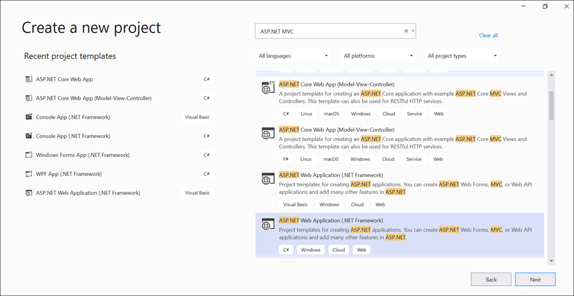
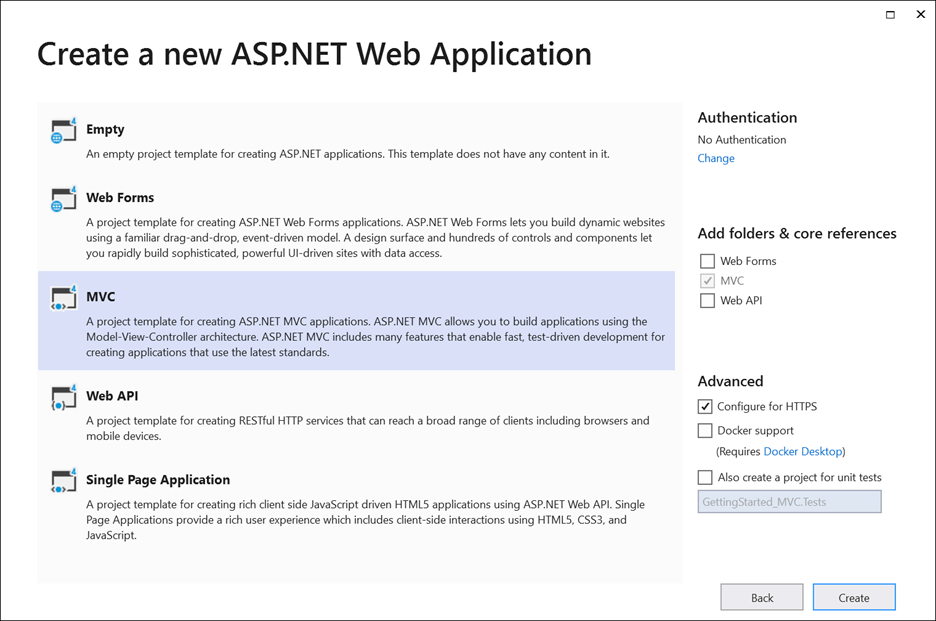
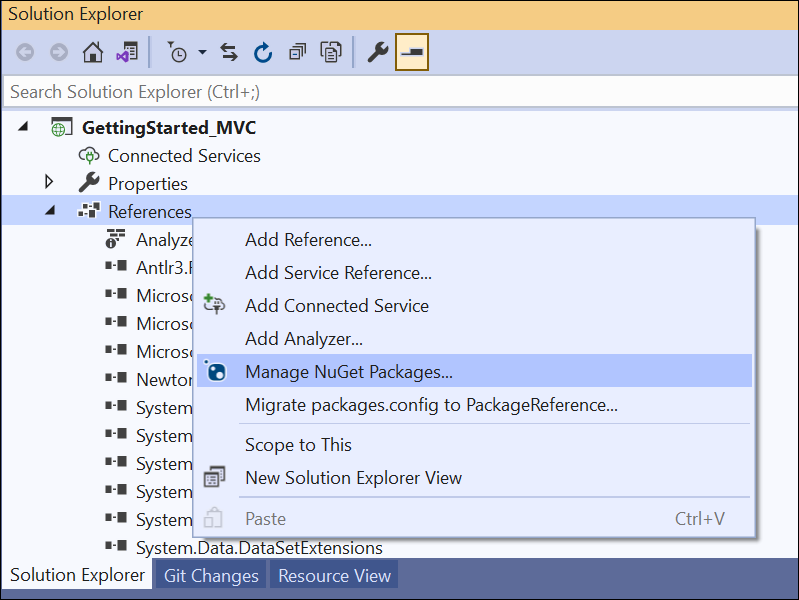
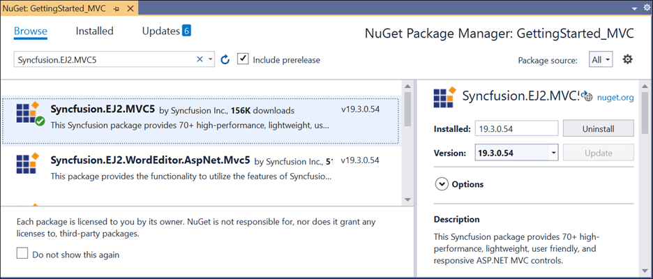

# Getting Started with ASP.NET MVC

> Starting with v16.4.0.x, if you reference Syncfusion assemblies from trial setup or the NuGet feed, include a license key in your projects. Refer to this [link](https://help.syncfusion.com/common/essential-studio/licensing/license-key) to learn about registering Syncfusion license key in your ASP.NET MVC application to use Syncfusion components.

## Prerequisites

To get started with the ASP.NET MVC application, ensure that the following software is installed on the machine.

* Visual Studio
* .Net Framework 4.5 and above.
* ASP.NET MVC 4 or ASP.NET MVC 5

## Preparing ASP.NET MVC application

The following steps are used to create an ASP.NET MVC application.

**Step 1:** Create ASP.NET MVC web application with default template project in Visual Studio.

* Create a new project


* Configure the project


* Create ASP.NET MVC web application


**Step 2:** After creating the project, add the following dependencies to your application by using `NuGet Package Manager`.

* Syncfusion.EJ2.PdfViewer.AspNet.Mvc5
* Syncfusion.EJ2.MVC5

Open the `NuGet` package manager.



Install the **Syncfusion.EJ2.PdfViewer.AspNet.Mvc5** package to the application.


Install the **Syncfusion.EJ2.MVC5** package to the application.



**Step 3 :** Add the following assemblies in `Views\Shared\_Layout.cshtml` and `Views\Home\Index.cshtml` view pages.

 ```html
@using Syncfusion.EJ2
@using Syncfusion.EJ2.PdfViewer
```

**Step 4:** Add client side resource through [`CDN`](https://cdn.syncfusion.com/ej2/dist/ej2.min.js) or local [`package`](https://www.npmjs.com/package/@syncfusion/ej2) in the layout page `Views\Shared\_Layout.cshtml` by replacing the existing `head` tag content.

```html
<head>
@* Syncfusion Essential JS2 Scripts *@
@Styles.Render("https://cdn.syncfusion.com/ej2/material.css")
@Scripts.Render("https://cdn.syncfusion.com/ej2/dist/ej2.min.js")
</head>
```

If no version is specified, then the styles and resources of the latest version will be referred. You can specify a particular CDN version too as below.

```html
<head>
@* Syncfusion Essential JS2 Scripts *@
@Styles.Render("https://cdn.syncfusion.com/ej2/19.3.54/material.css")
@Scripts.Render("https://cdn.syncfusion.com/ej2/19.3.54/dist/ej2.min.js")
</head>
```

**Step 5:** Add Script Manager in the layout page `_Layout.cshtml` by replacing the existing `body` content.

```html
<body>
    @RenderBody()
    @RenderSection("scripts", required: false)
    @Html.EJS().ScriptManager()
</body>
```

**Step 6:** Add the below razor code to the Index.cshtml view page by removing all the existing `Div` tags, which is presented under Views/Home folder, to initialize the PDF Viewer. Also, add a new controller called PdfViewerController under Controllers and add the following code into it.






















You can load a PDF file in the PDF Viewer by specifying the document name in the DocumentPath property as below.

```html
<div style="height:500px;width:100%;">
    @Html.EJS().PdfViewer("pdfviewer").ServiceUrl(VirtualPathUtility.ToAbsolute("~/PdfViewer/")).DocumentPath("PDF_Succinctly.pdf").Render()
</div>
```

In this code line,

*PdfViewer("pdfviewer")* refers to the PdfViewer component among the EJ components with id as "pdfviewer".

*ServiceUrl* is necessary to communicate with the server which also specifies the path of the controller. Here, PdfViewer is the name of the controller.

*DocumentPath* is the property needed to load a PDF file in the PDF Viewer. The specified document must be placed inside the folder structure that matches with the path in the GetDocumentPath(string document) method inside the PdfViewerController.

You can download the sample from [here](https://www.syncfusion.com/downloads/support/directtrac/general/ze/GettingStarted_MVC-1781406184).

> You can refer to our [ASP.NET MVC PDF Viewer](https://www.syncfusion.com/aspnet-mvc-ui-controls/pdf-viewer) feature tour page for its groundbreaking feature representations. You can also explore our [ASP.NET MVC PDF Viewer example](https://ej2.syncfusion.com/aspnetmvc/PdfViewer/Default#/material) to understand the core features of PDF Viewer.