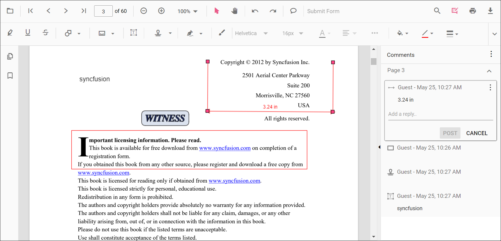
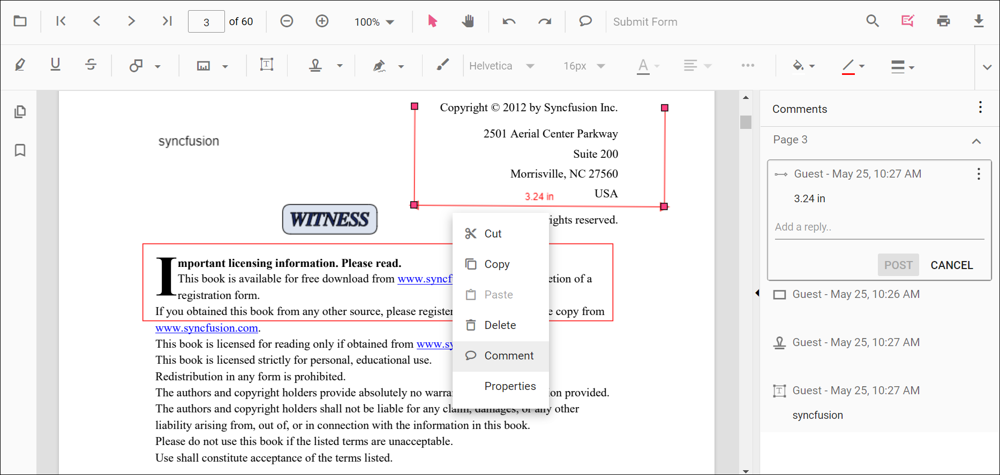
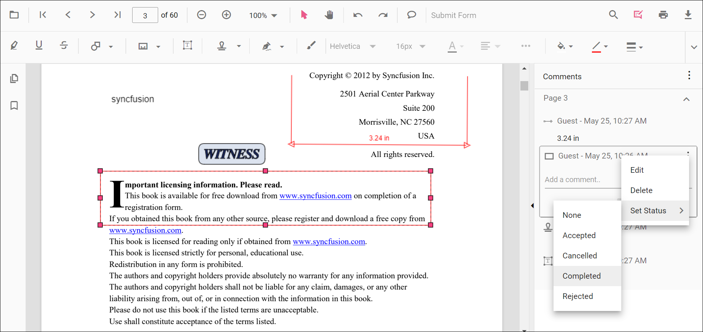
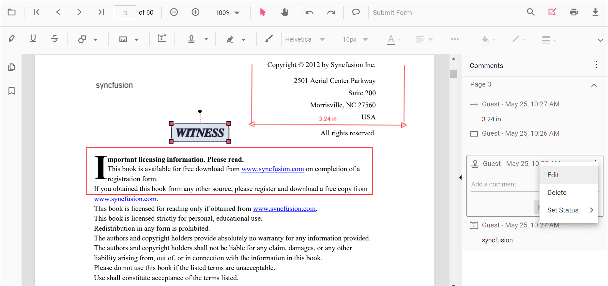
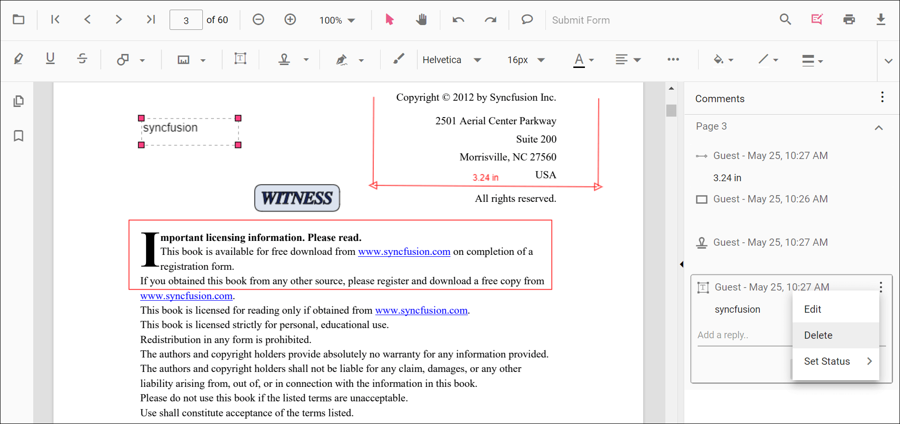

# Comments in the ASP.NET Core PDF Viewer component

The PDF Viewer control provides options to add, edit, and delete the comments to the following annotation in the PDF documents:

* Shape annotation
* Stamp annotation
* Sticky note annotation
* Measurement annotation
* Text markup annotation
* Free text annotation
* Ink annotation

## Adding a comment to the annotation

Annotation comment, comment replies, and status can be added to the PDF document using the comment panel.

### Comment panel

Annotation comments can be added to the PDF using the comment panel. The comment panel can be opened in the following ways:

1. Using the annotation menu

    * Click the Edit Annotation button in the PDF Viewer toolbar. A toolbar appears below it.
    * Click the Comment Panel button. A comment panel will appear.

2. Using Context menu

    * Select annotation in the PDF document and right-click it.
    * Select the comment option in the context menu that appears.

3. Using the Mouse click

    * Select annotation in the PDF document and double click it, a comment panel will appear.

If the comment panel is already in the open state, you can select the annotations and add annotation comments using the comment panel.

### Adding comments

* Select annotation in the PDF document and click it.
* The selected annotation comment container is highlighted in the comment panel.
* Now, you can add comment and comment replies using the comment panel.

### Adding Comment Replies

* The PDF Viewer control provides an option to add multiple replies to the comment.
* After adding the annotation comment, you can add a reply to the comment.

### Adding Comment or Reply Status

* Select the Annotation Comments in the comment panel.
* Click the more options button showing in the Comments or reply container.
* Select the Set Status option in the context menu that appears.
* Select the status of the annotation comment in the context menu that appears.

### Editing the comments and comments replies of the annotations

The comment, comment replies, and status of the annotation can be edited using the comment panel.

### Editing the Comment or Comment Replies

The annotation comment and comment replies can be edited in the following ways:

1. Using the Context menu

    * Select the Annotation Comments in the comment panel.
    * Click the More options button showing in the Comments or reply container.
    * Select the Edit option in the context menu that appears.
    * Now, an editable text box appears. You can change the content of the annotation comment or comment reply.

2. Using the Mouse Click

    * Select the annotation comments in the comment panel.
    * Double click the comment or comment reply content.
    * Now, an editable text box appears. You can change the content of the annotation comment or comment reply.

### Editing Comment or Reply Status

* Select the Annotation Comments in the comment panel.
* Click the more options button showing in the Comments or reply container.
* Select the Set Status option in the context menu that appears.
* Select the status of the annotation comment in the context menu that appears.
* Status ‘None’ is the default state. If the status is set to ‘None,’ the comments or reply does not appear.

### Delete Comment or Comment Replies

* Select the Annotation Comments in the comment panel.
* Click the more options button shown in the Comments or reply container.
* Select the Delete option in the context menu that appears.

>The annotation will be deleted on deleting the comment using comment panel.