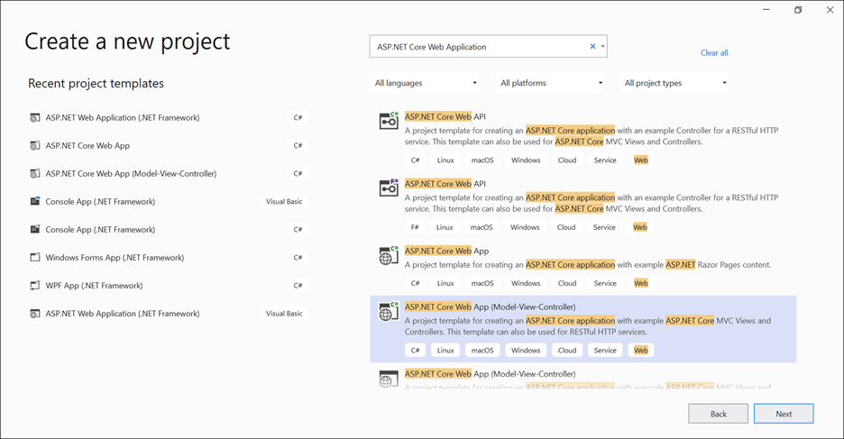
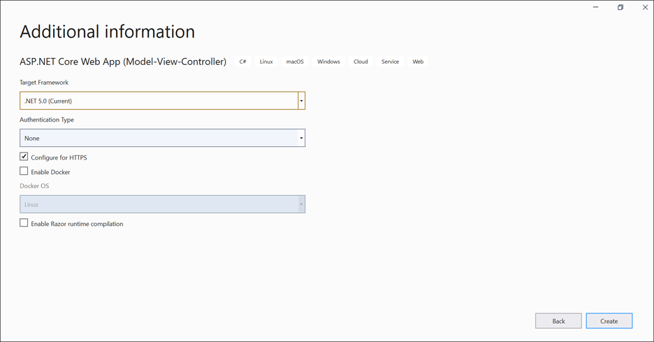
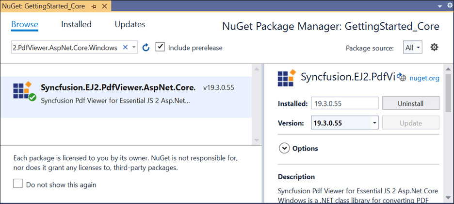

# Getting Started in ASP.NET Core PDF Viewer control

> Starting with v16.4.0.x, if you reference Syncfusion assemblies from trial setup or from the NuGet feed, include a license key in your projects. Refer to this [link](https://help.syncfusion.com/common/essential-studio/licensing/license-key) to learn about registering Syncfusion license key in your ASP.NET Core application to use Syncfusion components.

## Prerequisites

To get started with ASP.NET Core application, ensure that the following software is installed on the machine.
* .NET Core 2.0 or .NET Core 2.1 with Visual Studio 2017
(or)
* .NET Core 3.0 or .NET Core 3.1 with Visual Studio 2019

## Setup ASP.NET Core application with Essential JS 2 for ASP.NET Core

The following steps are used to create ASP.NET Core application.

**Step 1:** Create ASP.NET Core web application with default template project in Visual Studio.

* Create a new project


* Configure the project


* Specify the target framework and create the ASP.NET Core Web App.


**Step 2:** After creating the project, add the following dependencies to your application by using `NuGet Package Manager`.
* Syncfusion.EJ2.AspNet.Core
* Syncfusion.EJ2.PdfViewer.AspNet.Core.Windows

Open the `NuGet` package manager.


Install the **Syncfusion.EJ2.AspNet.Core** package to the application.


Install the **Syncfusion.EJ2.PdfViewer.AspNet.Core.Windows** package to the application.



>For Linux and OSX operating systems use the corresponding libraries as below,
* Syncfusion.EJ2.PdfViewer.AspNet.Core.Linux
* Syncfusion.EJ2.PdfViewer.AspNet.Core.OSX

**Step 3:** For ASP.NET Core 3.0 or later, install the **Microsoft.AspNetCore.Mvc.NewtonsoftJson** NuGet package and configure to serialize the JSON objects by adding the below namespace and the code to the ConfigureServices(IServiceCollection services) method of the Startup.cs file.


```cs
using Newtonsoft.Json.Serialization;
```

```cs
services.AddControllers().AddNewtonsoftJson(options =>
{
    // Use the default property (Pascal) casing
    options.SerializerSettings.ContractResolver = new DefaultContractResolver();
});
```

>The Microsoft.AspNetCore.Mvc.NewtonsoftJson NuGet version should match the target framework version of the ASP.NET Core application.
>
>For example, choose 5.0.* version for .NET 5.0 project.

**Step 4:** Open the **Views/_ViewImports.cshtml** file and add the below line to import Syncfusion.EJ2 package.

```cs
@addTagHelper *, Syncfusion.EJ2
```

**Step 5:** Add client side resource through [`CDN`](https://cdn.syncfusion.com/ej2/dist/ej2.min.js) or local [`package`](https://www.npmjs.com/package/@syncfusion/ej2) in the layout page **Views/Shared/_Layout.cshtml** by replacing the existing `head` tag content.

```html
<head>
    <meta charset="utf-8" />
    <meta name="viewport" content="width=device-width, initial-scale=1.0" />
    <title>@ViewData["Title"] - GettingStarted_Core</title>

    @* Syncfusion Essential JS 2 Styles *@
    <link rel="stylesheet" href="https://cdn.syncfusion.com/ej2/material.css" />

    @* Syncfusion Essential JS 2 Scripts *@
    <script src="https://cdn.syncfusion.com/ej2/dist/ej2.min.js"></script>
</head>
```

If no version is specified, then the styles and resources of the latest version will be referred. You can specify a particular CDN version too as below.

```html
<head>
    <meta charset="utf-8" />
    <meta name="viewport" content="width=device-width, initial-scale=1.0" />
    <title>@ViewData["Title"] - GettingStarted_Core</title>
    @* Syncfusion Essential JS 2 Styles *@
    <link rel="stylesheet" href="https://cdn.syncfusion.com/ej2/19.3.55/material.css" />

    @* Syncfusion Essential JS 2 Scripts *@
    <script src="https://cdn.syncfusion.com/ej2/19.3.55/dist/ej2.min.js"></script>
</head>
```

**Step 6:** Add Script Manager in the layout page **Views/Shared/_Layout.cshtml** by replacing the existing `body` content.

```cs
<body>
    @RenderBody()
    @RenderSection("Scripts", required: false)
    <ejs-scripts></ejs-scripts>
</body>
```

**Step 7:** Add the following code to the `Index.cshtml` view page by replacing the existing `Div` code, which is present under `Views/Home` folder, to initialize PDF Viewer. Also, add a new controller called PdfViewerController under Controllers and add the following code into it.






















You can load a PDF file in the PDF Viewer by specifying the document name in the documentPath property as below.

```html
<ejs-pdfviewer id="pdfviewer" style="height:600px" serviceUrl="/api/PdfViewer" documentPath="PDF_Succinctly.pdf"></ejs-pdfviewer>
```

In this code,

*ejs-pdfviewer* refers to the PdfViewer component among the EJ components with id as "pdfviewer".

*serviceUrl* is necessary to communicate with the server which also specifies the path of the controller. Here, PdfViewer is the name of the controller.

*documentPath* is the property needed to load a PDF file in the PDF Viewer. The specified document must be placed inside the folder structure that matches with the path in the GetDocumentPath(string document) method inside the PdfViewerController.

Download the Getting started sample from [here](https://www.syncfusion.com/downloads/support/directtrac/general/ze/GettingStarted_Core-1020074870.zip)

> You can refer to our [ASP.NET Core PDF Viewer](https://www.syncfusion.com/aspnet-core-ui-controls/pdf-viewer) feature tour page for its groundbreaking feature representations. You can also explore our [ASP.NET Core PDF Viewer example](https://ej2.syncfusion.com/aspnetcore/PdfViewer/Default#/material) to understand how to explains core features of PDF Viewer.