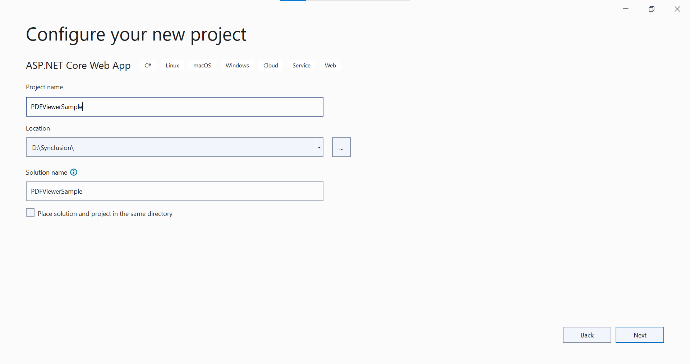

# Getting Started with ASP.NET Core PDF Viewer control

The [ASP.NET Core PDF Viewer](https://www.syncfusion.com/aspnet-core-ui-controls/pdf-viewer) control is used to viewing and printing PDF files in any web application. It provides the best viewing experience available with core interactions such as zooming, scrolling, text searching, text selection, and text copying. Thumbnail, bookmark, hyperlink and table of contents support provides easy navigation within and outside the PDF files. 

This section briefly explains about how to integrate ASP.NET Core PDF Viewer control in your ASP.NET Core application using Visual Studio.

## Prerequisites

[System requirements for ASP.NET Core controls](https://ej2.syncfusion.com/aspnetcore/documentation/system-requirements/)

## Integrate PDF Viewer into an ASP.NET Core application

1. Start Visual Studio and select **Create a new project**. 
2. In the **Create a new project** dialog, select **ASP.NET Core Web App**.

3. In the **Configure your new project** dialog, enter *Project Name* and select Next.

4. In the **Additional information** dialog, select **.NET 6.0 (Long-term Support) and then select **Create**. 
 

## ASP.NET Core PDF Viewer NuGet package installation

To add ASP.NET Core PDF Viewer control, the following NuGet package need to be installed in your ASP.NET Core application based on the operating system of the server you intend to host.

* For **Windows**, use [Syncfusion.EJ2.PdfViewer.AspNet.Core.Windows](https://www.nuget.org/packages/Syncfusion.EJ2.PdfViewer.AspNet.Core.Windows/)
* For **Linux**, use [Syncfusion.EJ2.PdfViewer.AspNet.Core.Linux](https://www.nuget.org/packages/Syncfusion.EJ2.PdfViewer.AspNet.Core.Linux/)
* For **macOS**, use [Syncfusion.EJ2.PdfViewer.AspNet.Core.OSX](https://www.nuget.org/packages/Syncfusion.EJ2.PdfViewer.AspNet.Core.OSX/)

## Add Syncfusion ASP.NET Core Tag Helper

Open `~/Views/_ViewImports.cshtml` file and import the `Syncfusion.EJ2` TagHelper.




@addTagHelper *, Syncfusion.EJ2




## Add style sheet

The theme is referred using CDN inside the `<head>` of `~/Pages/Shared/_Layout.cshtml` file as follows,




<head>
    ...
    <!-- Syncfusion ASP.NET Core controls styles -->
    <link rel="stylesheet" href="https://cdn.syncfusion.com/ej2/{{ site.ej2version }}/fluent.css" />
</head>




N> Checkout the [Themes topic](https://ej2.syncfusion.com/aspnetcore/documentation/appearance/theme/) to learn different ways ([CDN](https://ej2.syncfusion.com/aspnetcore/documentation/common/adding-script-references#cdn-reference), [NPM package](https://ej2.syncfusion.com/aspnetcore/documentation/common/adding-script-references#node-package-manager-npm), and [CRG](https://ej2.syncfusion.com/aspnetcore/documentation/common/custom-resource-generator/)) to refer styles in ASP.NET Core application, and to have the expected appearance for Syncfusion ASP.NET Core controls. 

## Add script reference

In this getting started walk-through, the required scripts are referred using CDN inside the `<head>` of `~/Pages/Shared/_Layout.cshtml` file as follows,




<head>
    ...
    <!-- Syncfusion ASP.NET Core controls scripts -->
    
</head>




## Register Syncfusion Script Manager

Open `~/Pages/Shared/_Layout.cshtml` page and register the script manager <ejs-script> at the end of `<body>` in the ASP.NET Core application as follows. 




<body>
    ....
    ....
    <!-- Syncfusion ASP.NET Core Script Manager -->
    <ejs-scripts></ejs-scripts>
</body>




## Add ASP.NET Core PDF Viewer control

Now, add the Syncfusion ASP.NET Core PDF Viewer tag helper in `~/Pages/Index.cshtml` page. You can load a PDF file in the PDF Viewer by specifying the document name in the documentPath property as below.




@page "{handler?}"
@model IndexModel
@{
    ViewData["Title"] = "Home page";
}

    <ejs-pdfviewer id="pdfviewer" style="height:600px" serviceUrl="/Index" documentPath="Files/Essential_Pdf.pdf">
    </ejs-pdfviewer>



using Microsoft.AspNetCore.Mvc;
using Microsoft.Extensions.Caching.Memory;
using Syncfusion.EJ2.PdfViewer;
using Newtonsoft.Json;
using Microsoft.AspNetCore.Mvc.RazorPages;
using System.Reflection;

namespace PDFViewerSample.Pages
{
    [IgnoreAntiforgeryToken(Order = 1001)]
    public class IndexModel : PageModel
    {

        private readonly Microsoft.AspNetCore.Hosting.IHostingEnvironment _hostingEnvironment;
        private IMemoryCache _cache;

        public IndexModel(Microsoft.AspNetCore.Hosting.IHostingEnvironment hostingEnvironment, IMemoryCache cache)
        {
            _hostingEnvironment = hostingEnvironment;
            _cache = cache;
        }

        public IActionResult OnPostLoad([FromBody] jsonObjects responseData)
        {
            PdfRenderer pdfviewer = new PdfRenderer(_cache);
            MemoryStream stream = new MemoryStream();
            var jsonObject = JsonConverterstring(responseData);
            object jsonResult = new object();
            if (jsonObject != null && jsonObject.ContainsKey("document"))
            {
                if (bool.Parse(jsonObject["isFileName"]))
                {
                    string documentPath = GetDocumentPath(jsonObject["document"]);
                    if (!string.IsNullOrEmpty(documentPath))
                    {
                        byte[] bytes = System.IO.File.ReadAllBytes(documentPath);
                        stream = new MemoryStream(bytes);
                    }
                    else
                    {
                        return this.Content(jsonObject["document"] + " is not found");
                    }
                }
                else
                {
                    byte[] bytes = Convert.FromBase64String(jsonObject["document"]);
                    stream = new MemoryStream(bytes);
                }
            }
            jsonResult = pdfviewer.Load(stream, jsonObject);
            return Content(JsonConvert.SerializeObject(jsonResult));
        }
        public Dictionary<string, string> JsonConverterstring(jsonObjects results)
        {
            Dictionary<string, object> resultObjects = new Dictionary<string, object>();
            resultObjects = results.GetType().GetProperties(BindingFlags.Instance | BindingFlags.Public)
                .ToDictionary(prop => prop.Name, prop => prop.GetValue(results, null));
            var emptyObjects = (from kv in resultObjects
                                where kv.Value != null
                                select kv).ToDictionary(kv => kv.Key, kv => kv.Value);
            Dictionary<string, string> jsonResult = emptyObjects.ToDictionary(k => k.Key, k => k.Value.ToString());
            return jsonResult;
        }
        //Post action for processing the PDF documents.
        public IActionResult OnPostRenderPdfPages([FromBody] jsonObjects responseData)
        {
            PdfRenderer pdfviewer = new PdfRenderer(_cache);
            var jsonObject = JsonConverterstring(responseData);
            object jsonResult = pdfviewer.GetPage(jsonObject);
            return Content(JsonConvert.SerializeObject(jsonResult));
        }
        //Post action for unloading and disposing the PDF document resources
        public IActionResult OnPostUnload([FromBody] jsonObjects responseData)
        {
            PdfRenderer pdfviewer = new PdfRenderer(_cache);
            var jsonObject = JsonConverterstring(responseData);
            pdfviewer.ClearCache(jsonObject);
            return this.Content("Document cache is cleared");
        }
        //Post action for rendering the ThumbnailImages
        public IActionResult OnPostRenderThumbnailImages([FromBody] jsonObjects responseData)
        {
            PdfRenderer pdfviewer = new PdfRenderer(_cache);
            var jsonObject = JsonConverterstring(responseData);
            object result = pdfviewer.GetThumbnailImages(jsonObject);
            return Content(JsonConvert.SerializeObject(result));
        }
        //Post action for processing the bookmarks from the PDF documents
        public IActionResult OnPostBookmarks([FromBody] jsonObjects responseData)
        {
            PdfRenderer pdfviewer = new PdfRenderer(_cache);
            var jsonObject = JsonConverterstring(responseData);
            object jsonResult = pdfviewer.GetBookmarks(jsonObject);
            return Content(JsonConvert.SerializeObject(jsonResult));
        }
        //Post action for rendering the annotation comments
        public IActionResult OnPostRenderAnnotationComments([FromBody] jsonObjects responseData)
        {
            PdfRenderer pdfviewer = new PdfRenderer(_cache);
            var jsonObject = JsonConverterstring(responseData);
            object jsonResult = pdfviewer.GetAnnotationComments(jsonObject);
            return Content(JsonConvert.SerializeObject(jsonResult));
        }
        //Post action for exporting the annotations

        public IActionResult OnPostExportAnnotations([FromBody] jsonObjects responseData)
        {
            PdfRenderer pdfviewer = new PdfRenderer(_cache);
            var jsonObject = JsonConverterstring(responseData);
            string jsonResult = pdfviewer.ExportAnnotation(jsonObject);
            return Content(jsonResult);
        }
        //Post action for importing the annotations
        public IActionResult OnPostImportAnnotations([FromBody] jsonObjects responseData)
        {
            PdfRenderer pdfviewer = new PdfRenderer(_cache);
            var jsonObject = JsonConverterstring(responseData);
            string jsonResult = string.Empty;
            object JsonResult;
            if (jsonObject != null && jsonObject.ContainsKey("fileName"))
            {
                string documentPath = GetDocumentPath(jsonObject["fileName"]);
                if (!string.IsNullOrEmpty(documentPath))
                {
                    jsonResult = System.IO.File.ReadAllText(documentPath);
                }
                else
                {
                    return this.Content(jsonObject["document"] + " is not found");
                }
            }
            else
            {
                string extension = Path.GetExtension(jsonObject["importedData"]);
                if (extension != ".xfdf")
                {
                    JsonResult = pdfviewer.ImportAnnotation(jsonObject);
                    return Content(JsonConvert.SerializeObject(JsonResult));
                }
                else
                {
                    string documentPath = GetDocumentPath(jsonObject["importedData"]);
                    if (!string.IsNullOrEmpty(documentPath))
                    {
                        byte[] bytes = System.IO.File.ReadAllBytes(documentPath);
                        jsonObject["importedData"] = Convert.ToBase64String(bytes);
                        JsonResult = pdfviewer.ImportAnnotation(jsonObject);
                        return Content(JsonConvert.SerializeObject(JsonResult));
                    }
                    else
                    {
                        return this.Content(jsonObject["document"] + " is not found");
                    }
                }
            }

            return Content(jsonResult);
        }
        //Post action for downloading the PDF documents
        public IActionResult OnPostDownload([FromBody] jsonObjects responseData)
        {
            PdfRenderer pdfviewer = new PdfRenderer(_cache);
            var jsonObject = JsonConverterstring(responseData);
            string documentBase = pdfviewer.GetDocumentAsBase64(jsonObject);
            return Content(documentBase);
        }
        //Post action for printing the PDF documents
        public IActionResult OnPostPrintImages([FromBody] jsonObjects responseData)
        {
            PdfRenderer pdfviewer = new PdfRenderer(_cache);
            var jsonObject = JsonConverterstring(responseData);
            object pageImage = pdfviewer.GetPrintImage(jsonObject);
            return Content(JsonConvert.SerializeObject(pageImage));
        }
        //Gets the path of the PDF document
        private string GetDocumentPath(string document)
        {
            string documentPath = string.Empty;
            if (!System.IO.File.Exists(document))
            {
                string basePath = _hostingEnvironment.WebRootPath;
                string dataPath = string.Empty;
                dataPath = basePath + "/";
                if (System.IO.File.Exists(dataPath + (document)))
                    documentPath = dataPath + document;
            }
            else
            {
                documentPath = document;
            }
            return documentPath;
        }
    }
    public class jsonObjects
    {

        public string document { get; set; }
        public string password { get; set; }
        public int zoomFactor { get; set; }
        public bool isFileName { get; set; }
        public int xCoordinate { get; set; }
        public int yCoordinate { get; set; }
        public int pageNumber { get; set; }
        public int tileXcount { get; set; }
        public int tileYcount { get; set; }
        public string extraText { get; set; }
        public string documentId { get; set; }
        public string hashId { get; set; }
        public float sizeX { get; set; }
        public float sizeY { get; set; }
        public int startPage { get; set; }
        public int endPage { get; set; }
        public string stampAnnotations { get; set; }
        public string textMarkupAnnotations { get; set; }
        public string stickyNotesAnnotation { get; set; }
        public string shapeAnnotations { get; set; }
        public string measureShapeAnnotations { get; set; }
        public string action { get; set; }
        public int pageStartIndex { get; set; }
        public int pageEndIndex { get; set; }
        public string fileName { get; set; }
        public string elementId { get; set; }
        public string pdfAnnotation { get; set; }
        public string importPageList { get; set; }
        public string annotationDataFormat { get; set; }
        public string uniqueId { get; set; }
        public string data { get; set; }
        public float viwePortWidth { get; set; }
        public float viewportHeight { get; set; }
        public int tilecount { get; set; }
        public bool isCompletePageSizeNotReceived { get; set; }
        public string freeTextAnnotation { get; set; }
        public string signatureData { get; set; }
        public string fieldsData { get; set; }
        public string documentLiveCount { get; set; }
    }
}



In this code,

**ejs-pdfviewer** refers to the PDFViewer control among the EJ components with id as "pdfviewer".

**serviceUrl** is necessary to communicate with the server which also specifies the path of the controller. Here, PdfViewer is the name of the controller.

**documentPath** is the property needed to load a PDF file in the PDF Viewer. The specified document must be placed inside the folder structure that matches with the path in the GetDocumentPath(string document) method inside the PdfViewerController.

Press <kbd>Ctrl</kbd>+<kbd>F5</kbd> (Windows) or <kbd>⌘</kbd>+<kbd>F5</kbd> (macOS) to run the app. Then, the Syncfusion ASP.NET Core PDF Viewer control will be rendered in the default web browser.

> [View Sample in GitHub](https://github.com/SyncfusionExamples/ASP-NET-Core-Getting-Started-Examples/tree/main/PDFViewer/ASP.NET%20Core%20Tag%20Helper%20Examples).

## See also

* [Getting Started with Syncfusion ASP.NET Core using Razor Pages](https://ej2.syncfusion.com/aspnetcore/documentation/getting-started/razor-pages/)
* [Getting Started with Syncfusion ASP.NET Core MVC using Tag Helper](https://ej2.syncfusion.com/aspnetcore/documentation/getting-started/aspnet-core-mvc-taghelper)