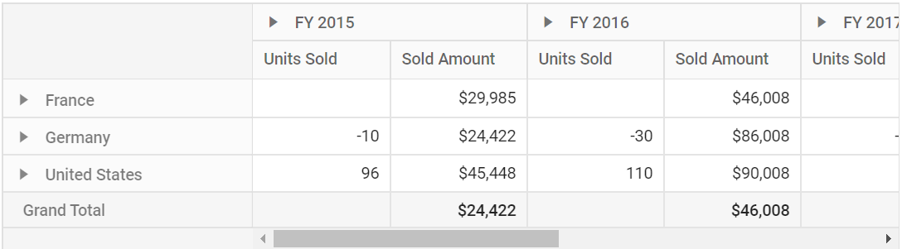
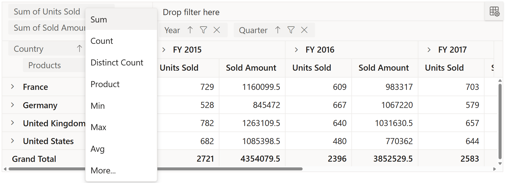
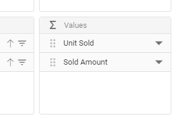
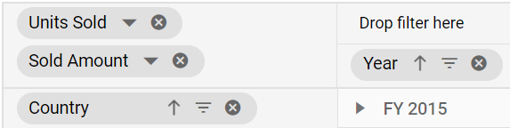
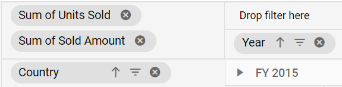

# Aggregation

End user can perform calculations over a group of values (exclusively for value fields bound in value axis) using the aggregation option. By default, values are added (summed) together. The other aggregation types are explained below.

> The fields with data type such as number support all aggregation types mentioned below except for **"CalculatedField"**. The fields with data type such as string, date, datetime, boolean, etc., support **"Count"** and **"DistinctCount"** aggregation types alone.

| Operator | Description |
|------|-------------|
| Sum| Displays the pivot table values with sum.|
| Product| Displays the pivot table values with product.|
| Count| Displays the pivot table values with count.|
| DistinctCount| Displays the pivot table values with distinct count.|
| Min| Displays the pivot table with minimum value.|
| Max| Displays the pivot table with maximum value.|
| Avg| Displays the pivot table values with average.|
| Index| Displays the pivot table values with index.|
| PopulationStDev| Displays the pivot table values with standard deviation of population.|
| SampleStDev| Displays the pivot table values with sample standard deviation.|
| PopulationVar| Displays the pivot table values with variance of population.|
| SampleVar| Displays the pivot table values with sample variance.|
| RunningTotals| Displays the pivot table values with running totals.|
| DifferenceFrom| Displays the pivot table values with difference from the value of the base item in the base field.|
| PercentageOfDifferenceFrom| Displays the pivot table values with percentage difference from the value of the base item in the base field.|
| PercentageOfGrandTotal| Displays the pivot table values with percentage of grand total of all values.|
| PercentageOfColumnTotal| Displays the pivot table values in each column with percentage of total values for the column.|
| PercentageOfRowTotal| Displays the pivot table values in each row with percentage of total values for the row.|
| PercentageOfParentTotal| Displays the pivot table values with percentage of total of all values based on selected field.|
| PercentageOfParentColumnTotal| Displays the pivot table values with percentage of its parent total in each column.|
| PercentageOfParentRowTotal| Displays the pivot table values with percentage of its parent total in each row.|
| CalculatedField| Displays the pivot table with calculated field values. It allows user to create a new calculated field alone.|

## Assigning aggregation type for value fields through API

For each value field, the aggregation type can be set using the property [`Type`](https://help.syncfusion.com/cr/aspnetcore-js2/Syncfusion.EJ2.PivotView.PivotViewRow.html#Syncfusion_EJ2_PivotView_PivotViewRow_Type) in [`Value`](https://help.syncfusion.com/cr/aspnetmvc-js2/Syncfusion.EJ2.PivotView.ValuesDataSourceSettings.html) class. Meanwhile, aggregation types like [**SummaryTypes.DifferenceFrom**](https://help.syncfusion.com/cr/aspnetmvc-js2/Syncfusion.EJ2.PivotView.SummaryTypes.html) and [**SummaryTypes.PercentageOfDifferenceFrom**](https://help.syncfusion.com/cr/aspnetmvc-js2/Syncfusion.EJ2.PivotView.SummaryTypes.html) can check for specific field of specific item using [`BaseField`](https://help.syncfusion.com/cr/aspnetcore-js2/Syncfusion.EJ2.PivotView.PivotViewRow.html#Syncfusion_EJ2_PivotView_PivotViewRow_BaseField) and [`BaseItem`](https://help.syncfusion.com/cr/aspnetcore-js2/Syncfusion.EJ2.PivotView.PivotViewRow.html#Syncfusion_EJ2_PivotView_PivotViewRow_BaseItem) properties. Likewise, [**SummaryTypes.PercentageOfParentTotal**](https://help.syncfusion.com/cr/aspnetmvc-js2/Syncfusion.EJ2.PivotView.SummaryTypes.html) type can for specific field using `BaseField` property. For instance, the aggregation type [**SummaryTypes.DifferenceFrom**](https://help.syncfusion.com/cr/aspnetmvc-js2/Syncfusion.EJ2.PivotView.SummaryTypes.html) would intake the specified field and its corresponding member as input and its value is compared across other members in the same field and also across different fields to formulate an appropriate output value.  

* [`Type`](https://help.syncfusion.com/cr/aspnetcore-js2/Syncfusion.EJ2.PivotView.PivotViewRow.html#Syncfusion_EJ2_PivotView_PivotViewRow_Type): It allows to set the aggregate type of the field.
* [`BaseField`](https://help.syncfusion.com/cr/aspnetcore-js2/Syncfusion.EJ2.PivotView.PivotViewRow.html#Syncfusion_EJ2_PivotView_PivotViewRow_BaseField): It allows to set the specific field to aggregate the values.
* [`BaseItem`](https://help.syncfusion.com/cr/aspnetcore-js2/Syncfusion.EJ2.PivotView.PivotViewRow.html#Syncfusion_EJ2_PivotView_PivotViewRow_BaseItem): It allows to set the specific member to aggregate the values.
























> By default, the aggregation will be considered as [**SummaryTypes.Sum**](https://help.syncfusion.com/cr/aspnetmvc-js2/Syncfusion.EJ2.PivotView.SummaryTypes.html) to the value fields which had number type and for the value fields which had non-number type values such as string, date, datetime, boolean, etc., the aggregation type will be considered as [**SummaryTypes.Count**](https://help.syncfusion.com/cr/aspnetmvc-js2/Syncfusion.EJ2.PivotView.SummaryTypes.html).

## Modifying aggregation type for value fields at runtime

Aggregation types can be changed easily through UI at runtime. The value fields bound to grouping bar and field list appears with a dropdown icon which helps to select an appropriate aggregation type for the respective value field. On selection, the values in the pivot table will be changed dynamically.
























<!-- markdownlint-disable MD012 -->

 
 

## Hiding aggregation type from button text

By default, in value axis each field would be displayed by its name and aggregation type together. To hide aggregation type and display field name alone, set the property [`ShowAggregationOnValueField`](https://help.syncfusion.com/cr/aspnetcore-js2/Syncfusion.EJ2.PivotView.PivotViewDataSourceSettings.html#Syncfusion_EJ2_PivotView_PivotViewDataSourceSettings_ShowAggregationOnValueField)  in [`PivotViewDataSourceSettings`](https://help.syncfusion.com/cr/aspnetmvc-js2/Syncfusion.EJ2.PivotView.PivotViewDataSourceSettings.html) class to **false**.
























 

## Hiding aggregation type icon from UI

By default, the icon to set aggregation type is enabled in the grouping bar. To disable this icon, set the property [`ShowValueTypeIcon`](https://help.syncfusion.com/cr/aspnetcore-js2/Syncfusion.EJ2.PivotView.PivotViewGroupingBarSettings.html#Syncfusion_EJ2_PivotView_PivotViewGroupingBarSettings_ShowValueTypeIcon) in [`PivotViewGroupingBarSettings`](https://help.syncfusion.com/cr/aspnetmvc-js2/Syncfusion.EJ2.PivotView.PivotViewGroupingBarSettings.html) class to **false**.

> Icon to change the aggregation type can be hidden only in Grouping Bar but not in Field List at the moment.
























