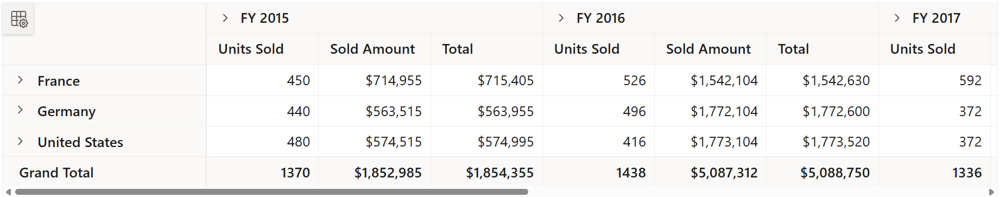
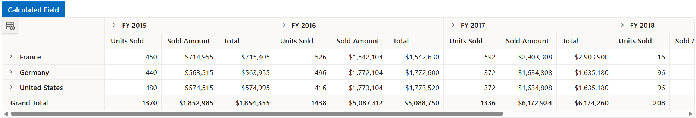
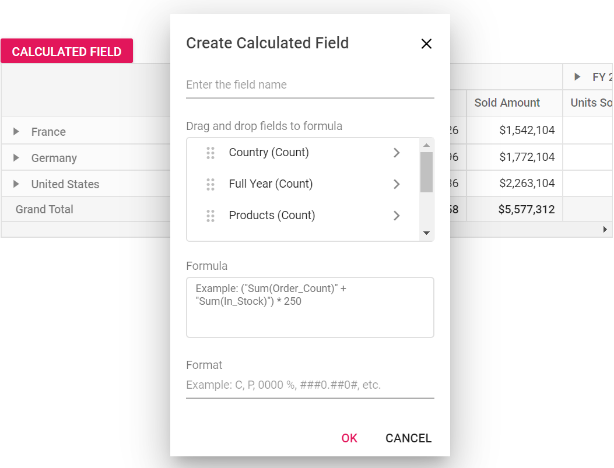
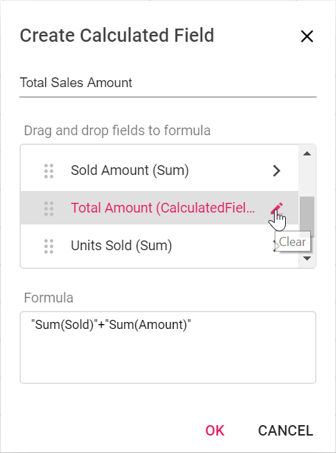
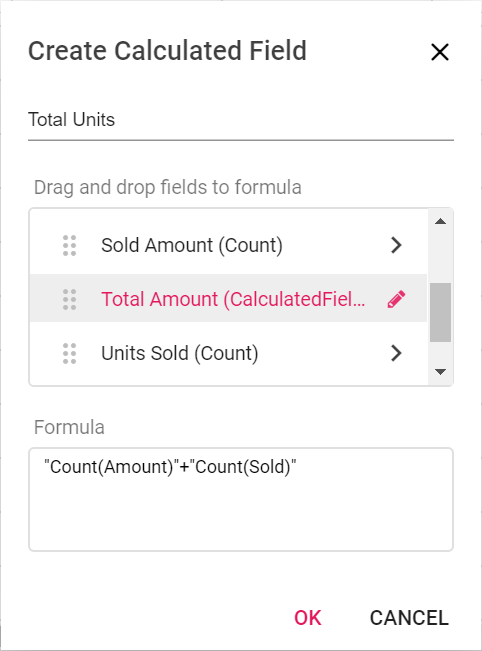
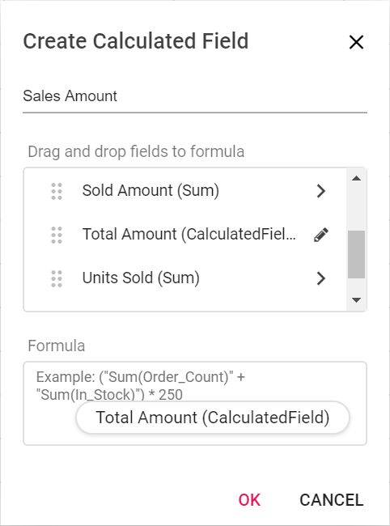
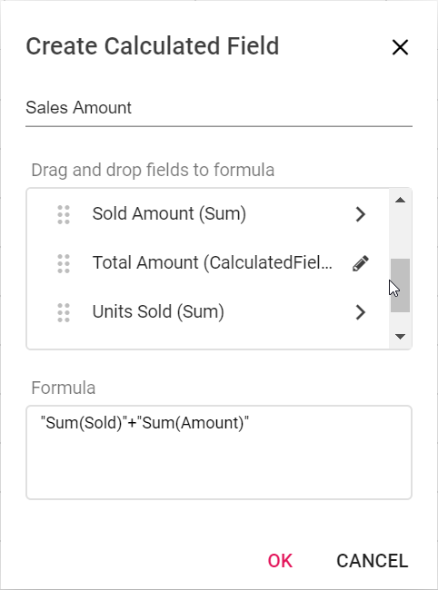
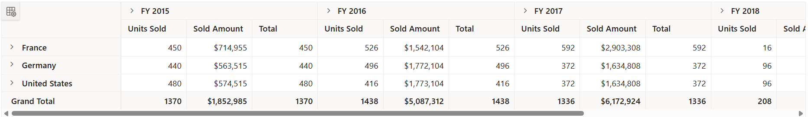

# Calculated Field

Allows end user to create a new calculated field in the pivot table, based on available fields from the bound data source or using simple formula with basic arithmetic operators. It can be added at runtime through the built-in dialog, invoked from Field List UI. To do so, set the [`AllowCalculatedField`](https://help.syncfusion.com/cr/aspnetcore-js2/Syncfusion.EJ2.PivotView.PivotView.html#Syncfusion_EJ2_PivotView_PivotView_AllowCalculatedField) property in [`PivotView`](https://help.syncfusion.com/cr/aspnetmvc-js2/Syncfusion.EJ2.PivotView.PivotView.html) class to **true** in the pivot table. End user can now see a "CALCULATED FIELD" button enabled in Field List UI automatically, which on clicking will invoke the calculated field dialog and perform necessary operation.

Calculated field can also be included in the pivot table through code behind using the [`PivotViewCalculatedFieldsSettings`](https://help.syncfusion.com/cr/aspnetmvc-js2/Syncfusion.EJ2.PivotView.PivotViewCalculatedFieldSetting.html) class. The required properties to create a new calculate field are:
* [`Name`](https://help.syncfusion.com/cr/aspnetcore-js2/Syncfusion.EJ2.PivotView.PivotViewCalculatedFieldSetting.html#Syncfusion_EJ2_PivotView_PivotViewCalculatedFieldSetting_Name): It allows to indicate the calculated field with a unique name.
* [`Formula`](https://help.syncfusion.com/cr/aspnetcore-js2/Syncfusion.EJ2.PivotView.PivotViewCalculatedFieldSetting.html#Syncfusion_EJ2_PivotView_PivotViewCalculatedFieldSetting_Formula): It allows to set the formula.

> The calculated field is applicable only for value fields. Also, calculated field created through code behind will be automatically listed in the UI dialog as well.



























Meanwhile, user can also view calculated field dialog in UI by invoking `CreateCalculatedFieldDialog` method on an external button click which is shown in the below code sample.





























## Renaming the existing calculated field

Existing calculated field can be renamed only through the UI at runtime. To do so, open the calculated field dialog, select the target field and click "Edit" icon. User can now see the existing name getting displayed in the text box at the top of the dialog. Now, change the name based on user requirement and click "OK".

<!-- markdownlint-disable MD012 -->

<br/>
<br/>


## Editing the existing calculated field formula

Existing calculated field formula can be edited only through the UI at runtime. To do so, open the calculated field dialog, select the target field and click "Edit" icon. User can now see the existing formula getting displayed in a multiline text box at the bottom of the dialog. Now, change the formula based on user requirement and click "OK".


<br/>
<br/>


## Reusing the existing formula in a new calculate field

While creating a new calculated field, if user wants to the add the formula of an existing calculated field, it can be done easily. To do so, simply drag-and-drop the existing calculated field to the "Formula" section.


<br/>
<br/>

<br/>
<br/>


## Supported operators and functions for the calculated field formula

Below is a list of operators and functions that can be used in the formula to create the calculated fields.

* `+` – addition operator.

```typescript
 Syntax: X + Y
```

* `-` – subtraction operator.

```typescript
Syntax: X - Y
```

* `*` – multiplication operator.

```typescript
Syntax: X * Y
```

* `/` – division operator.

```typescript
Syntax: X / Y
```

* `^` – power operator.

```typescript
Syntax: X^2
```

* `<` - less than operator.

```typescript
Syntax: X < Y
```

* `<=` – less than or equal operator.

```typescript
Syntax: X <= Y
```

* `>` – greater than operator.

```typescript
Syntax: X > Y
```

* `>=` – greater than or equal operator.

```typescript
Syntax: X >= Y
```

* `==` – equal operator.

```typescript
Syntax: X == Y
```

* `!=` – not equal operator.

```typescript
Syntax: X != Y
```

* `|` – OR operator.

```typescript
Syntax: X | Y
```

* `&` – AND operator.

```typescript
Syntax: X & Y
```

* `?` – conditional operator.

```typescript
Syntax: condition ? then : else
```

* `isNaN` – function that checks if the value is not a number.

```typescript
Syntax: isNaN(value)
```

* `!isNaN` – function that checks if the value is a number.

```typescript
Syntax: isNaN(value)
```

* `abs` – function that returns the absolute value of a number.

```typescript
Syntax: abs(number)
```

* `min` – function that returns the minimum value.

```typescript
Syntax: min(number1, number2)
```

* `max` – function that returns the maximum value.

```typescript
Syntax: max(number1, number2)
```

> Also, you can use JavaScript [Math](https://developer.mozilla.org/en-US/docs/Web/JavaScript/Reference/Global_Objects/Math) object properties and methods directly to the formula.

























