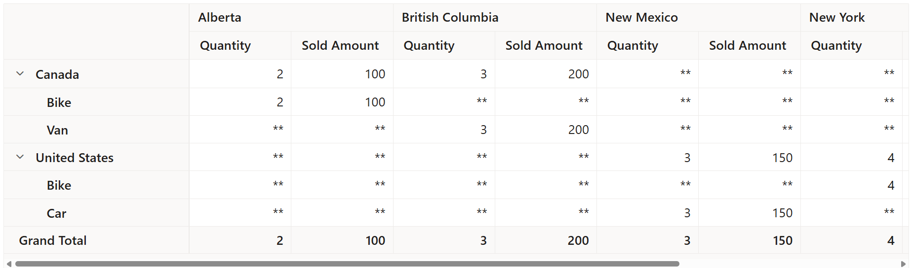

# Data Binding

The pivot table uses `DataManager`, which supports both RESTful JSON data service binding and local JavaScript object array binding. The [`DataSource`](https://help.syncfusion.com/cr/aspnetcore-js2/Syncfusion.EJ2.PivotView.PivotViewDataSourceSettingsBuilder.html#Syncfusion_EJ2_PivotView_PivotViewDataSourceSettingsBuilder_DataSource_System_Action_Syncfusion_EJ2_DataManagerBuilder__) property can be assigned either with the instance of `DataManager` or list of objects. It supports two kinds of data binding method:

* Local data
* Remote data

## Local Data

To bind local data to the pivot table, user can assign a list of object to the [`DataSource`](https://help.syncfusion.com/cr/aspnetcore-js2/Syncfusion.EJ2.PivotView.PivotViewDataSourceSettingsBuilder.html#Syncfusion_EJ2_PivotView_PivotViewDataSourceSettingsBuilder_DataSource_System_Action_Syncfusion_EJ2_DataManagerBuilder__) property under [`PivotViewDataSourceSettings`](https://help.syncfusion.com/cr/aspnetmvc-js2/Syncfusion.EJ2.PivotView.PivotViewDataSourceSettingsBuilder.html) class. The list data source can also be provided as an instance of the `DataManager` class.

> By default, `DataManager` uses `JsonAdaptor` for local data-binding.
























## Remote Data

To interact with remote data source, provide the endpoint `Url` within `DataManager`. By default, `DataManager` uses `ODataAdaptor` for remote data-binding.
























### Binding with OData services

OData is a standardized protocol for creating and consuming data. User can retrieve data from OData service using the `DataManager` class. Refer to the following code example for remote data binding using OData service.
























### Binding with OData V4 services

The OData V4 is an improved version of OData protocols, and the `DataManager` class can be used to retrieve and consume OData V4 services. For more details on OData V4 services, refer to the [OData documentation](http://docs.oasis-open.org/odata/odata/v4.0/errata03/os/complete/part1-protocol/odata-v4.0-errata03-os-part1-protocol-complete.html#_Toc453752197). To bind OData V4 service, use the [`ODataV4Adaptor`](https://ej2.syncfusion.com/documentation/data/adaptors/#odatav4-adaptor).
























### Web API

User can use `WebApiAdaptor` to bind pivot table with Web API created using OData endpoint.
























## Values in row axis

By default, the value fields are plotted in column axis. To plot those fields in row axis, use the `valueAxis` property by setting its value as `row`. By default, it holds the value `column`.
























## Show 'no data' items

By default, the pivot table only shows the field item if it has data in its row or column combination. To show all items that do not have data in row and column combination in the pivot table, use the [`ShowNoDataItems`](https://help.syncfusion.com/cr/aspnetcore-js2/Syncfusion.EJ2.PivotView.PivotViewRow.html#Syncfusion_EJ2_PivotView_PivotViewRow_ShowNoDataItems) property by settings its value to **true** for the desired fields. In the following code sample, rows of the "Country" and "State" fields do not have data in all combination with "Date" column field.
























## Always shows the value headers

To show the value header always in pivot table even it holding a single value, use the [`AlwaysShowValueHeader`](https://help.syncfusion.com/cr/aspnetcore-js2/Syncfusion.EJ2.PivotView.PivotViewDataSourceSettings.html#Syncfusion_EJ2_PivotView_PivotViewDataSourceSettings_AlwaysShowValueHeader) property by settings its value as **true**.
























## Customize empty value cells

User can show custom string in empty value cells using the [`EmptyCellsTextContent`](https://help.syncfusion.com/cr/aspnetcore-js2/Syncfusion.EJ2.PivotView.PivotViewDataSourceSettings.html#Syncfusion_EJ2_PivotView_PivotViewDataSourceSettings_EmptyCellsTextContent) property in [`PivotViewDataSourceSettings`](https://help.syncfusion.com/cr/aspnetmvc-js2/Syncfusion.EJ2.PivotView.PivotViewDataSourceSettings.html) class of the pivot table. Since the property is of string data type, user can fill empty value cells with any value like "0", "-", "*", "(blank)", etc. Its common for all value fields and can be configured through code behind.
























## See Also

* [Aggregation](./aggregation)
* [Show/Hide Totals](./summary-customization)
* [Customize number, date, and time values](./how-to/customize-number-date-and-time-values)