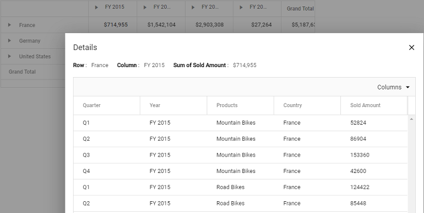

<!-- markdownlint-disable MD012 -->

# Drill Through

Allows to view the underlying raw data of a summarized cell in the pivot table. It can be enabled by setting the [`AllowDrillThrough`](https://help.syncfusion.com/cr/aspnetcore-js2/Syncfusion.EJ2.PivotView.PivotView.html#Syncfusion_EJ2_PivotView_PivotView_AllowDrillThrough) property to **true**. By double-clicking on any value cell, user can view the detailed raw data in a data grid inside a new window. In the new window, row header, column header and measure name of the clicked cell will be shown at the top. Also, user can include or exclude fields available in the data grid using column chooser option.
























