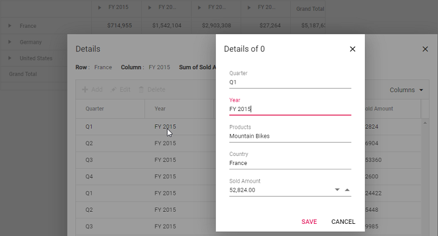

# Editing

Cell edit allows to add, delete, or update the raw items of any value cell from the pivot table. The raw items can be viewed in a data grid inside a new window on double-clicking the appropriate value cell. In the data grid, CRUD operations can be performed by double-clicking the cells or using toolbar options. Once user finishes editing raw items, aggregation will be performed for the updated values in pivot table component immediately. This support can be enabled by setting the [`AllowEditing`](https://help.syncfusion.com/cr/aspnetcore-js2/Syncfusion.EJ2.PivotView.PivotViewCellEditSettings.html#Syncfusion_EJ2_PivotView_PivotViewCellEditSettings_AllowEditing) property in [`PivotViewCellEditSettings`](https://help.syncfusion.com/cr/aspnetmvc-js2/Syncfusion.EJ2.PivotView.PivotViewCellEditSettings.html) class to **true**.

The CRUD operations available in the data grid toolbar and command column are:

| Toolbar Button | Actions |
|----------------|---------|
| Add | Add a new row.|
| Edit | Edit the current row or cell.|
| Delete | Delete the current row.|
| Update | Update the edited row or cell.|
| Cancel | Cancel the edited state. |

The following are the supported edit types in the data grid:

* Normal
* Dialog
* Batch
* Command Columns

## Normal

In normal edit mode, when user starts editing, the state of the currently selected row alone will be completely changed to edit state. User can change the cell values and save it to the data source by clicking "Update" toolbar button. To enable the normal edit, set the [`Mode`](https://help.syncfusion.com/cr/aspnetcore-js2/Syncfusion.EJ2.PivotView.PivotViewCellEditSettings.html#Syncfusion_EJ2_PivotView_PivotViewCellEditSettings_Mode) property in [`PivotViewCellEditSettings`](https://help.syncfusion.com/cr/aspnetmvc-js2/Syncfusion.EJ2.PivotView.PivotViewCellEditSettings.html) class to [**EditMode.Normal**](https://help.syncfusion.com/cr/aspnetmvc-js2/Syncfusion.EJ2.PivotView.EditMode.html).

> The normal edit mode is the default mode of editing..
























## Dialog

In dialog edit mode, when you start editing, the currently selected row data will be shown in a dialog.
You can change the cell values and save it to the data source by clicking **Save**.
To enable the dialog edit, set the [`Mode`](https://help.syncfusion.com/cr/aspnetcore-js2/Syncfusion.EJ2.PivotView.PivotViewCellEditSettings.html#Syncfusion_EJ2_PivotView_PivotViewCellEditSettings_Mode) property in [`PivotViewCellEditSettings`](https://help.syncfusion.com/cr/aspnetmvc-js2/Syncfusion.EJ2.PivotView.PivotViewCellEditSettings.html) class to [**EditMode.Dialog**](https://help.syncfusion.com/cr/aspnetmvc-js2/Syncfusion.EJ2.PivotView.EditMode.html).
























## Batch

In batch edit mode, when you double-click the table cell, the state of target cell is changed to edit state.
You can perform bulk save (added, changed, and deleted data in the single request) to the data source by clicking the toolbar's **Update** button.

To enable the batch edit, set the [`Mode`](https://help.syncfusion.com/cr/aspnetcore-js2/Syncfusion.EJ2.PivotView.PivotViewCellEditSettings.html#Syncfusion_EJ2_PivotView_PivotViewCellEditSettings_Mode) property in [`PivotViewCellEditSettings`](https://help.syncfusion.com/cr/aspnetmvc-js2/Syncfusion.EJ2.PivotView.PivotViewCellEditSettings.html) class to [**EditMode.Batch**](https://help.syncfusion.com/cr/aspnetmvc-js2/Syncfusion.EJ2.PivotView.EditMode.html).
























## Command column

An additional column appended in the grid layout holds the command buttons to perform the CRUD operation.
To enable the command columns, set the [`AllowCommandColumns`](https://help.syncfusion.com/cr/aspnetcore-js2/Syncfusion.EJ2.PivotView.PivotViewCellEditSettings.html#Syncfusion_EJ2_PivotView_PivotViewCellEditSettings_Mode) property in [`PivotViewCellEditSettings`](https://help.syncfusion.com/cr/aspnetmvc-js2/Syncfusion.EJ2.PivotView.PivotViewCellEditSettings.html) class to **true**.

The available built-in command buttons are:

| Command Button | Actions |
|----------------|---------|
| Edit | Edit the current row.|
| Delete | Delete the current row.|
| Save | Update the edited row.|
| Cancel | Cancel the edited state. |
























