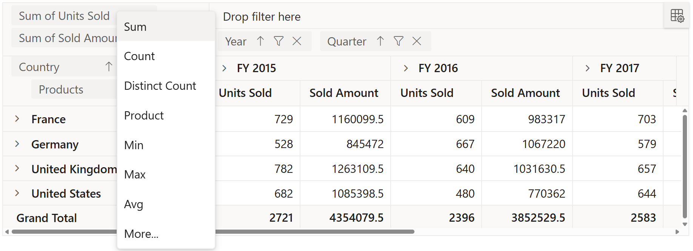

# Grouping Bar

The Grouping Bar option in pivot table automatically populates fields from the bound data source and allows end users to drag fields between different axes such as columns, rows, values, and filters, and create pivot table at runtime. It can be enabled by setting the [`ShowGroupingBar`](https://help.syncfusion.com/cr/aspnetcore-js2/Syncfusion.EJ2.PivotView.PivotView.html#Syncfusion_EJ2_PivotView_PivotView_ShowGroupingBar) property in [`PivotView`](https://help.syncfusion.com/cr/aspnetmvc-js2/Syncfusion.EJ2.PivotView.PivotView.html) class to **true**.

Similar to Field List, Grouping Bar UI also comes with basic interactions like,

* Re-arranging fields through drag-and-drop operation between row, column, value and filter axes.
* Remove fields from the existing report using remove icon.
* Filtering members of specific fields using filter icon.
* Sorting members of specific fields using sort icon.

> The grouping bar provides some additional options to customize it's UI using `GroupingBarSettings` property.





## Show or hide filter icon

The Grouping Bar has an option to filter members of particular fields at runtime in pivot table. In-order to filter members in a field, click the filter icon and check/uncheck members that needs to be displayed. By default, filter icon besides each field is enabled in the grouping bar. To disable the filter icon, set the property [`ShowFilterIcon`](https://help.syncfusion.com/cr/aspnetcore-js2/Syncfusion.EJ2.PivotView.PivotViewGroupingBarSettings.html#Syncfusion_EJ2_PivotView_PivotViewGroupingBarSettings_ShowFilterIcon) in [`PivotViewGroupingBarSettings`](https://help.syncfusion.com/cr/aspnetmvc-js2/Syncfusion.EJ2.PivotView.PivotViewGroupingBarSettings.html) class to **false**.

> By default, the filter icon is enabled in the grouping bar.





## Show or hide sort icon

The Grouping Bar has an option to order members of a particular fields either in ascending or descending at runtime. In order to sort a field, click the sort icon and to reverse its sort direction, once again click the same sort icon. By default, the sort icon besides each field is enabled in the grouping bar and members will be arranged in ascending order. To disable the sort option, set the property [`ShowSortIcon`](https://help.syncfusion.com/cr/aspnetcore-js2/Syncfusion.EJ2.PivotView.PivotViewGroupingBarSettings.html#Syncfusion_EJ2_PivotView_PivotViewGroupingBarSettings_ShowFilterIcon) in [`PivotViewGroupingBarSettings`](https://help.syncfusion.com/cr/aspnetmvc-js2/Syncfusion.EJ2.PivotView.PivotViewGroupingBarSettings.html) class to **false**.

> By default, the sort icon is enabled in the grouping bar.





## Show or hide remove icon

The Grouping Bar has an option to remove any field at runtime. To remove a field, just click the remove icon. By default, the remove icon besides each field is enabled in the grouping bar. To disable the remove icon, set the property [`ShowRemoveIcon`](https://help.syncfusion.com/cr/aspnetcore-js2/Syncfusion.EJ2.PivotView.PivotViewGroupingBarSettings.html#Syncfusion_EJ2_PivotView_PivotViewGroupingBarSettings_ShowFilterIcon) in [`PivotViewGroupingBarSettings`](https://help.syncfusion.com/cr/aspnetmvc-js2/Syncfusion.EJ2.PivotView.PivotViewGroupingBarSettings.html) class to **false**.

> By default, the remove icon is enabled in the grouping bar.





## Disable all fields from dragging

The Grouping Bar has an option to drag-and-drop fields between row, column, value and filter axes in-order to change report at runtime. By default, all fields are available for drag-and-drop operation in the grouping bar. To disable these fields, set the property [`AllowDragAndDrop`](https://help.syncfusion.com/cr/aspnetcore-js2/Syncfusion.EJ2.PivotView.PivotViewGroupingBarSettings.html#Syncfusion_EJ2_PivotView_PivotViewGroupingBarSettings_AllowDragAndDrop) in [`PivotViewGroupingBarSettings`](https://help.syncfusion.com/cr/aspnetmvc-js2/Syncfusion.EJ2.PivotView.PivotViewGroupingBarSettings.html) class to **false**. This will prevent end user from changing the current report.





## Changing aggregation type of value fields at runtime

End user can perform calculations over a group of values using the aggregation option. The value fields bound to the field list, appears with a dropdown icon, helps to select an appropriate aggregation type at runtime. On selection, the values in the Pivot Table will be changed dynamically. By default, the icon to set aggregation type is enabled in the grouping bar. To disable this icon, set the property [`ShowValueTypeIcon`](https://help.syncfusion.com/cr/aspnetcore-js2/Syncfusion.EJ2.PivotView.PivotViewGroupingBarSettings.html#Syncfusion_EJ2_PivotView_PivotViewGroupingBarSettings_ShowValueTypeIcon) in [`PivotViewGroupingBarSettings`](https://help.syncfusion.com/cr/aspnetmvc-js2/Syncfusion.EJ2.PivotView.PivotViewGroupingBarSettings.html) class to **false**. To know more about aggregation, [`refer`](./aggregation) here.





<!-- markdownlint-disable MD012 -->

 
 
 

# Event

## FieldDropped

The event [`OnFieldDropped`](https://help.syncfusion.com/cr/aspnetcore-js2/Syncfusion.EJ2.PivotView.PivotView.html#Syncfusion_EJ2_PivotView_PivotView_OnFieldDropped) fires on whenever a field is dropped over an axis.

It has following parameters - `DroppedAxis`, `DroppedField` and `DataSourceSettings`. In this sample we have modified the `DroppedField` caption based on the `DroppedAxis`.





## See Also

* [Change load limited data in member editor](./how-to/change-load-limited-data-in-member-editor)
* [Customize the icons for pivot table](./how-to/customize-the-icons-for-pivot-table)