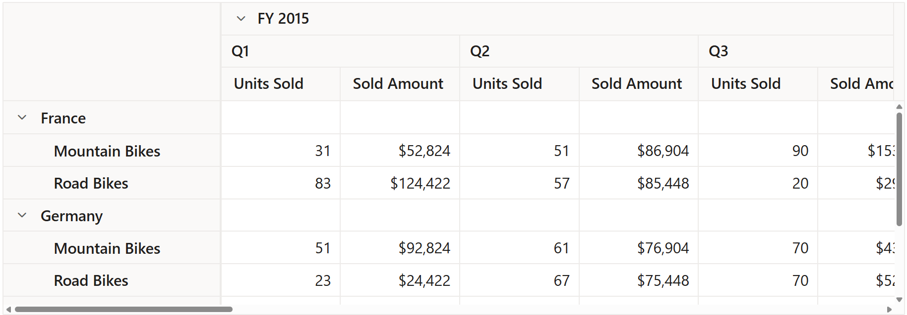

# Show or hide totals

## Show or hide grand totals

Allows to show or hide grand totals in rows and columns using the [`ShowGrandTotals`](https://help.syncfusion.com/cr/aspnetcore-js2/Syncfusion.EJ2.PivotView.PivotViewDataSourceSettings.html#Syncfusion_EJ2_PivotView_PivotViewDataSourceSettings_ShowGrandTotals) property. To hide the grand totals in rows and columns, set the property [`ShowGrandTotals`](https://help.syncfusion.com/cr/aspnetcore-js2/Syncfusion.EJ2.PivotView.PivotViewDataSourceSettings.html#Syncfusion_EJ2_PivotView_PivotViewDataSourceSettings_ShowGrandTotals) in [`PivotViewDataSourceSettings`](https://help.syncfusion.com/cr/aspnetmvc-js2/Syncfusion.EJ2.PivotView.PivotViewDataSourceSettings.html) class to **false**.
End user can also hide grand totals for row or columns separately by setting the property [`ShowRowGrandTotals`](https://help.syncfusion.com/cr/aspnetcore-js2/Syncfusion.EJ2.PivotView.PivotViewDataSourceSettings.html#Syncfusion_EJ2_PivotView_PivotViewDataSourceSettings_ShowRowGrandTotals) or [`ShowColumnGrandTotals`](https://help.syncfusion.com/cr/aspnetcore-js2/Syncfusion.EJ2.PivotView.PivotViewDataSourceSettings.html#Syncfusion_EJ2_PivotView_PivotViewDataSourceSettings_ShowColumnGrandTotals) in [`DataSourceSettings`](https://help.syncfusion.com/cr/aspnetmvc-js2/Syncfusion.EJ2.PivotView.PivotViewDataSourceSettings.html) class to **false** respectively.

> By default, [`ShowGrandTotals`](https://help.syncfusion.com/cr/aspnetcore-js2/Syncfusion.EJ2.PivotView.PivotViewDataSourceSettings.html#Syncfusion_EJ2_PivotView_PivotViewDataSourceSettings_ShowGrandTotals), [`ShowRowGrandTotals`](https://help.syncfusion.com/cr/aspnetcore-js2/Syncfusion.EJ2.PivotView.PivotViewDataSourceSettings.html#Syncfusion_EJ2_PivotView_PivotViewDataSourceSettings_ShowRowGrandTotals) and [`ShowColumnGrandTotals`](https://help.syncfusion.com/cr/aspnetcore-js2/Syncfusion.EJ2.PivotView.PivotViewDataSourceSettings.html#Syncfusion_EJ2_PivotView_PivotViewDataSourceSettings_ShowColumnGrandTotals) properties in [`PivotViewDataSourceSettings`](https://help.syncfusion.com/cr/aspnetmvc-js2/Syncfusion.EJ2.PivotView.PivotViewDataSourceSettings.html) class are set as **true**.
























## Show or hide sub-totals

Allows to show or hide sub-totals in rows and columns using the [`ShowSubTotals`](https://help.syncfusion.com/cr/aspnetcore-js2/Syncfusion.EJ2.PivotView.PivotViewDataSourceSettings.html#Syncfusion_EJ2_PivotView_PivotViewDataSourceSettings_ShowSubTotals) property. To hide all the sub-totals in rows and columns, set the property [`ShowSubTotals`](https://help.syncfusion.com/cr/aspnetcore-js2/Syncfusion.EJ2.PivotView.PivotViewDataSourceSettings.html#Syncfusion_EJ2_PivotView_PivotViewDataSourceSettings_ShowSubTotals) in [`DataSourceSettings`](https://help.syncfusion.com/cr/aspnetmvc-js2/Syncfusion.EJ2.PivotView.PivotViewDataSourceSettings.html) class to **false**. End user can also hide sub-totals for rows or columns separately by setting the property [`ShowRowSubTotals`](https://help.syncfusion.com/cr/aspnetcore-js2/Syncfusion.EJ2.PivotView.PivotViewDataSourceSettings.html#Syncfusion_EJ2_PivotView_PivotViewDataSourceSettings_ShowRowSubTotals) or [`ShowColumnSubTotals`](https://help.syncfusion.com/cr/aspnetcore-js2/Syncfusion.EJ2.PivotView.PivotViewDataSourceSettings.html#Syncfusion_EJ2_PivotView_PivotViewDataSourceSettings_ShowColumnSubTotals) in [`DataSourceSettings`](https://help.syncfusion.com/cr/aspnetmvc-js2/Syncfusion.EJ2.PivotView.PivotViewDataSourceSettings.html) class to **false** respectively.

> By default, [`ShowSubTotals`](https://help.syncfusion.com/cr/aspnetcore-js2/Syncfusion.EJ2.PivotView.PivotViewDataSourceSettings.html#Syncfusion_EJ2_PivotView_PivotViewDataSourceSettings_ShowRowSubTotals), [`ShowRowSubTotals`](https://help.syncfusion.com/cr/aspnetcore-js2/Syncfusion.EJ2.PivotView.PivotViewDataSourceSettings.html#Syncfusion_EJ2_PivotView_PivotViewDataSourceSettings_ShowRowSubTotals) and [`ShowColumnSubTotals`](https://help.syncfusion.com/cr/aspnetcore-js2/Syncfusion.EJ2.PivotView.PivotViewDataSourceSettings.html#Syncfusion_EJ2_PivotView_PivotViewDataSourceSettings_ShowColumnSubTotals) in [`DataSourceSettings`](https://help.syncfusion.com/cr/aspnetmvc-js2/Syncfusion.EJ2.PivotView.PivotViewDataSourceSettings.html) class are set as **true**.
























## Show or hide sub-totals for specific fields

Allows to show or hide sub-totals for specific fields in rows and columns using the [`ShowSubTotals`](https://help.syncfusion.com/cr/aspnetcore-js2/Syncfusion.EJ2.PivotView.PivotViewRow.html#Syncfusion_EJ2_PivotView_PivotViewRow_ShowSubTotals)) property. To hide sub-totals for a specific field in row or column axis, set the property [`ShowSubTotals`](https://help.syncfusion.com/cr/aspnetcore-js2/Syncfusion.EJ2.PivotView.PivotViewRow.html#Syncfusion_EJ2_PivotView_PivotViewRow_ShowSubTotals) property in [`Row`](https://help.syncfusion.com/cr/aspnetmvc-js2/Syncfusion.EJ2.PivotView.PivotViewRow.html) or [`Column`](https://help.syncfusion.com/cr/aspnetmvc-js2/Syncfusion.EJ2.PivotView.ColumnsDataSourceSettings.html) class to **false** respectively.

> By default, [`ShowSubTotals`](https://help.syncfusion.com/cr/aspnetcore-js2/Syncfusion.EJ2.PivotView.PivotViewRow.html#Syncfusion_EJ2_PivotView_PivotViewRow_ShowSubTotals) property in [`Row`](https://help.syncfusion.com/cr/aspnetmvc-js2/Syncfusion.EJ2.PivotView.PivotViewRow.html) or [`Column`](https://help.syncfusion.com/cr/aspnetmvc-js2/Syncfusion.EJ2.PivotView.ColumnsDataSourceSettings.html) class is set as **true**.
























## Show or hide totals using toolbar

It can also be achieved using built-in toolbar options by setting the [`ShowToolbar`](https://help.syncfusion.com/cr/aspnetcore-js2/Syncfusion.EJ2.PivotView.PivotView.html#Syncfusion_EJ2_PivotView_PivotView_ShowToolbar) property in [`PivotView`](https://help.syncfusion.com/cr/aspnetmvc-js2/Syncfusion.EJ2.PivotView.PivotView.html) class to **true**. Also, include the items **GrandTotal** and **SubTotal** within the [`Toolbar`](https://help.syncfusion.com/cr/aspnetcore-js2/Syncfusion.EJ2.PivotView.PivotView.html#Syncfusion_EJ2_PivotView_PivotView_Toolbar) property in [`PivotView`](https://help.syncfusion.com/cr/aspnetmvc-js2/Syncfusion.EJ2.PivotView.PivotView.html) class. End user can now see "Show/Hide Grand totals" and "Show/Hide Sub totals" icons in toolbar UI automatically.
























 

Additionally, with the built-in option available in the grand totals drop-down menu, the grand totals can be dynamically displayed at the top or bottom of the pivot table's row and column axes. By default, the grand totals are displayed at the bottom of the pivot table's row and column axes.

