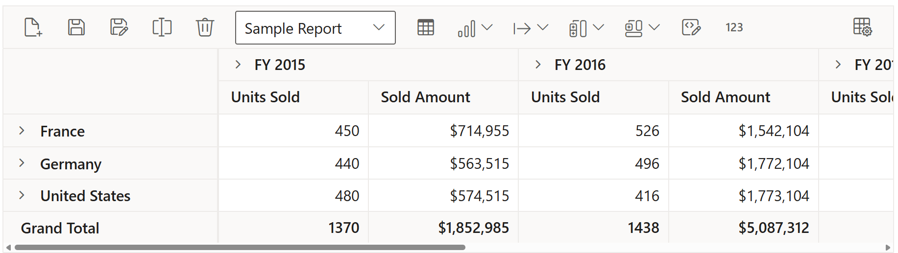

# Toolbar

Toolbar option allows to access the frequently used features like switching between pivot table and pivot chart, changing chart types, conditional formatting, exporting, etc... with ease at runtime. This option can be enabled by setting the [`ShowToolbar`](https://help.syncfusion.com/cr/aspnetcore-js2/Syncfusion.EJ2.PivotView.PivotView.html#Syncfusion_EJ2_PivotView_PivotView_ShowToolbar) property in [`PivotView`](https://help.syncfusion.com/cr/aspnetmvc-js2/Syncfusion.EJ2.PivotView.PivotView.html) class to **true**. The [`Toolbar`](https://help.syncfusion.com/cr/aspnetcore-js2/Syncfusion.EJ2.PivotView.PivotView.html#Syncfusion_EJ2_PivotView_PivotView_Toolbar) property in [`PivotView`](https://help.syncfusion.com/cr/aspnetmvc-js2/Syncfusion.EJ2.PivotView.PivotView.html) class accepts the collection of built-in toolbar options.

The following table shows built-in toolbar options and its actions.

| Built-in Toolbar Options | Actions |
|------------------------|---------|
| New | Creates a new report |
| Save | Saves the current report |
| Save As | Save as current report |
| Rename | Renames the current report |
| Delete | Deletes the current report |
| Load | Loads any report from the report list |
| Grid | Shows pivot table |
| Chart | Shows a chart in any type from the built-in list |
| Exporting | Exports the pivot table as PDF/Excel/CSV and the pivot chart as PDF and image |
| Sub-total | Shows or hides sub totals |
| Grand Total | Shows or hides grand totals |
| Conditional Formatting | Shows the conditional formatting pop-up to apply formatting |
| Number Formatting | Shows the number formatting pop-up to apply number formatting |
| Field List | Shows the fieldlist pop-up |

> The order of toolbar options can be changed by simply moving the position of items in the **ToolbarItems** collection. Also if end user wants to remove any toolbar option from getting displayed, it can be simply ignored from adding into the **ToolbarItems** collection.
























## Events

### FetchReport

The event [`FetchReport`](https://help.syncfusion.com/cr/aspnetcore-js2/Syncfusion.EJ2.PivotView.PivotView.html#Syncfusion_EJ2_PivotView_PivotView_RemoveReport) is triggered when dropdown list is clicked in the toolbar in-order to retrieve and populate saved reports. It has following parameter - `ReportName`. This event allows user to fetch the report names from local storage and populate the dropdown list.

### LoadReport

The event [`LoadReport`](https://help.syncfusion.com/cr/aspnetcore-js2/Syncfusion.EJ2.PivotView.PivotView.html#Syncfusion_EJ2_PivotView_PivotView_RemoveReport) is triggered when a report is selected from the dropdown list in the toolbar. It has following parameters - `Report` and `ReportName`. This event allows user to load the selected report to the pivot table.

### NewReport

The event [`NewReport`](https://help.syncfusion.com/cr/aspnetcore-js2/Syncfusion.EJ2.PivotView.PivotView.html#Syncfusion_EJ2_PivotView_PivotView_RemoveReport) is triggered when the new report icon is clicked in the toolbar. It has following parameter - `Report`. This event allows user to create new report and add to the report list.

### RenameReport

The event [`RenameReport`](https://help.syncfusion.com/cr/aspnetcore-js2/Syncfusion.EJ2.PivotView.PivotView.html#Syncfusion_EJ2_PivotView_PivotView_RemoveReport) is triggered when rename report icon is clicked in the toolbar. It has following parameters  - `Rename`, `Report` and `ReportName`. This event allows user to rename the selected report from the report list.

### RemoveReport

The event [`RemoveReport`](https://help.syncfusion.com/cr/aspnetcore-js2/Syncfusion.EJ2.PivotView.PivotView.html#Syncfusion_EJ2_PivotView_PivotView_RemoveReport) is triggered when remove report icon is clicked in the toolbar. It has following parameters  - `Report` and `ReportName`. This event allows user to remove the selected report from the report list.

### SaveReport

The event [`SaveReport`](https://help.syncfusion.com/cr/aspnetcore-js2/Syncfusion.EJ2.PivotView.PivotView.html#Syncfusion_EJ2_PivotView_PivotView_RemoveReport) is triggered when save report icon is clicked in the toolbar. It has following parameters  - `Report` and `ReportName`. This event allows user to save the altered report to the report list.
























## Customize toolbar items

You can customize the toolbar items in the `toolbarRender` event. Actions for the customized toolbar items are defined inside the customized toolbar item.

> By default, the custom toolbar items are positioned at left. You can change the position of the toolbar items by using the `align` property. In the following sample, the expand/collapse toolbar item is positioned at right.
























## Customize export settings

The pivot table (or) pivot chart can be exported as a pdf, excel, csv etc.,  document using the toolbar options. And, you can customize the export settings for exporting document by using the [`BeforeExport`](https://help.syncfusion.com/cr/aspnetcore-js2/Syncfusion.EJ2.PivotView.PivotView.html#Syncfusion_EJ2_PivotView_PivotView_BeforeExport) event in the toolbar.

For example, you can add the header and footer for the pdf document by setting the `header` and `footer` properties for the `pdfExportProperties` in the [`BeforeExport`](https://help.syncfusion.com/cr/aspnetcore-js2/Syncfusion.EJ2.PivotView.PivotView.html#Syncfusion_EJ2_PivotView_PivotView_BeforeExport) event.
























