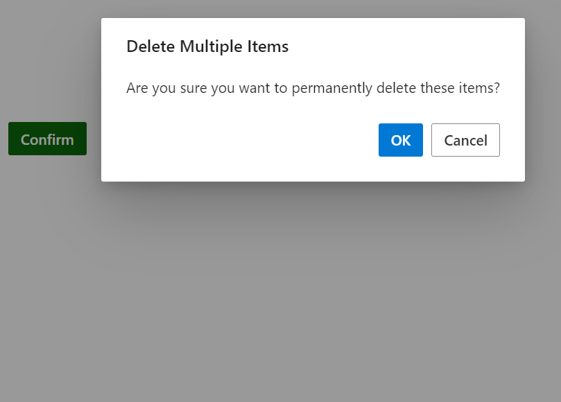

# Positioning in Predefined Dialogs in Blazor

Customize the dialog position by using the `position` property. The position can be represented with specific `X` and `Y` values.

* The `Position.X` can be configured with a left, center, right, or offset value. By default, the value is set as `center`.
* The `Position.Y` can be configured with a top, center, bottom, or offset value. By default, the value is set as `center`.

Use the following code snippet for **alert.cshtml**, **confirm.cshtml** and **prompt.cshtml** to customize the position. Here, customized the dialog position as X= "top" and Y= "center".





















**Alert**










**Confirm**










**Prompt**










**Results from the code snippet**

**Alert**

**Confirm**

**Prompt**

