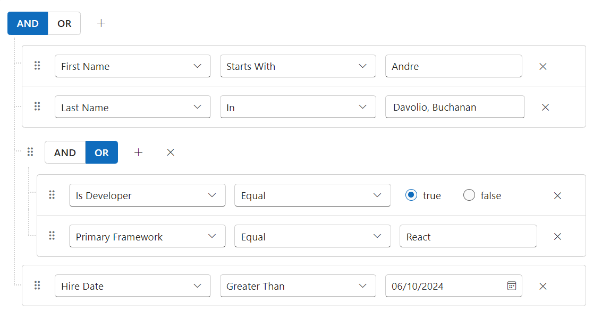

# Drag and drop in ##Platform_Name## Query builder control

The Query Builder provides the functionality to reposition rules or groups within the component effortlessly. This enhancement provides a more intuitive and flexible way to construct and modify queries. You can use [`AllowDragAndDrop`](https://help.syncfusion.com/cr/aspnetmvc-js2/Syncfusion.EJ2.QueryBuilder.QueryBuilder.html#Syncfusion_EJ2_QueryBuilder_QueryBuilder_AllowDragAndDrop) to perform drag and drop functionality. And we have events support for drag and drop features that, indicates the [`DragStart`](https://help.syncfusion.com/cr/aspnetmvc-js2/Syncfusion.EJ2.QueryBuilder.QueryBuilder.html#Syncfusion_EJ2_QueryBuilder_QueryBuilder_DragStart), [`Drag`](https://help.syncfusion.com/cr/aspnetmvc-js2/Syncfusion.EJ2.QueryBuilder.QueryBuilder.html#Syncfusion_EJ2_QueryBuilder_QueryBuilder_Drag) and [`Drop`](https://help.syncfusion.com/cr/aspnetmvc-js2/Syncfusion.EJ2.QueryBuilder.QueryBuilder.html#Syncfusion_EJ2_QueryBuilder_QueryBuilder_Drop) actions.
























Output be like the below.

