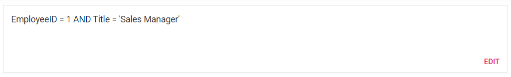

# Summary View in ##Platform_Name## Query Builder

Summary view allows you to show or hide the filtered query. By default, the value is false. You can enable by setting the `summaryView` property to true.
























