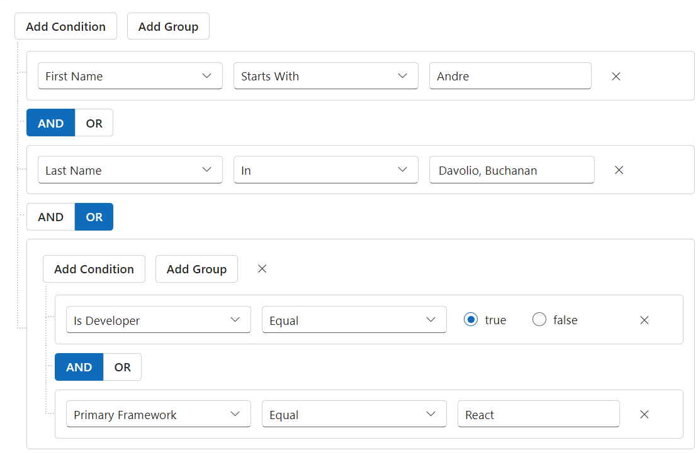

# Separate Connector in ##Platform_Name## Query builder control

The Query Builder provides the functionality to integrate standalone connectors between rules or groups within the same group. This allows for greater flexibility, as users can connect rules or groups using different connectors, enhancing the complexity and precision of query construction. You can use `EnableSeparateConnector` to perform separate connector functionality.
























Output be like the below.

