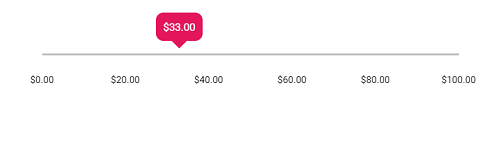
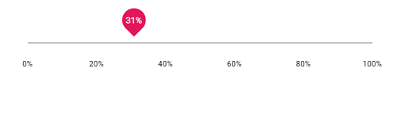

# Formatting

The `format` feature used to customize the units of Slider values to desired format. The formatted values will also be applied to the ARIA attributes of the slider. There are two ways of achieving formatting in slider.

* Use the [format](https://ej2.syncfusion.com/documentation/slider/api-tooltipData.html?lang=es5#format) API of slider which utilizes our [Internationalization](https://ej2.syncfusion.com/16.1.37/documentation/base/intl.html?lang=es5#loading-culture-data) to format values.

* Customize using the events namely `renderingTicks` and `tooltipChange`.
























## Using format API

In this method, we have different predefined formatting styles like Numeric (N), Percentage (P), Currency (C) and # specifiers. In this below example we have formatted the ticks and tooltip values into percentage.
























## Using Events

In this method, we will be retrieving the values from the slider events then process them to desired formatted the values. In this sample we have customized the ticks values into weekdays as one formatting and tooltip values into day of the week as another formatting.
























