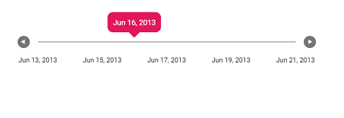

# Date Formatting in Range Slider

The Date formatting can be achieved in [`ticks`](https://help.syncfusion.com/cr/aspnetcore-js2/Syncfusion.EJ2.Inputs.Slider.html#Syncfusion_EJ2_Inputs_Slider_Ticks) and [`tooltip`](https://help.syncfusion.com/cr/aspnetcore-js2/Syncfusion.EJ2.Inputs.Slider.html#Syncfusion_EJ2_Inputs_Slider_Tooltip) using [`renderingTicks`](https://help.syncfusion.com/cr/aspnetcore-js2/Syncfusion.EJ2.Inputs.Slider.html#Syncfusion_EJ2_Inputs_Slider_RenderingTicks) and [`tooltipChange`](https://help.syncfusion.com/cr/aspnetcore-js2/Syncfusion.EJ2.Inputs.Slider.html#Syncfusion_EJ2_Inputs_Slider_TooltipChange) events respectively. The process of formatting is explained in the below sample.
























