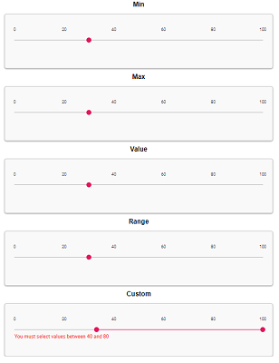

# Validate Range Slider Using FormValidator

The Slider control can be validated using our [FormValidator](https://ej2.syncfusion.com/documentation/form-validator/?lang=typescript). The following steps walk-through slider validation.

* Render slider control inside a form.
* Bind [changed](https://help.syncfusion.com/cr/aspnetcore-js2/Syncfusion.EJ2.Inputs.Slider.html#Syncfusion_EJ2_Inputs_Slider_Changed) event in the slider control to validate the slider value when the value changes.
* Initialize and render FormValidator for the form using form ID.
* Set the required property in the FormValidator [rules](https://ej2.syncfusion.com/documentation/api/form-validator/index-default#rules) collection. Here, the [min](https://help.syncfusion.com/cr/aspnetcore-js2/Syncfusion.EJ2.Inputs.Slider.html#Syncfusion_EJ2_Inputs_Slider_Min) property of slider that sets the minimum value in the slider control is set, and it has hidden input as enable `validateHidden` property is set to true.

N> Form validation is done either by ID or name value of the slider control. Above ID of the slider is used to validate it.

Using slider name: Render slider with name attribute. In the following code snippet, name attribute value of slider is used for form validation.

* Validate the form using [validate](https://ej2.syncfusion.com/documentation/api/form-validator/index-default#validate) method, and it validates the slider value with the defined rules collection and returns the result. If user selects the value less than the minimum value, form will not submit.

* Slider validation can be done during value changes in slider. Refer to the following code snippet.

```javascript

// change event handler for slider
function onChanged(args) {
  formObj.validate();
}

```

The `FormValidator` has following default validation rules, which are used to validate the Slider control.

| Rules | Description | Example |
| ------------- | ------------- | ------------- |
| `max` | Slider control must have value less than or equal to `max` number | if `max: 3`, **3** is valid and **4** is invalid |
| `min` | Slider control must have value greater than or equal to `min` number | if `min: 4`, **5** is valid and **2** is invalid |
| `regex` | Slider control must have valid value in `regex` format | if `regex: '/4/`, **4** is valid and **1** is invalid |
| `range` | Slider control must have value between `range` number | if `range: [4,5]`, **4** is valid and **6** is invalid |

























