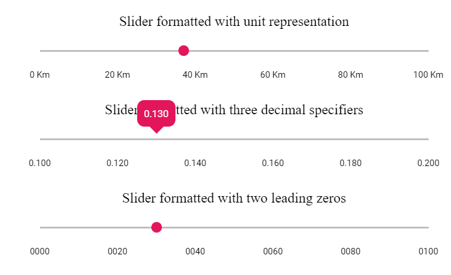

# Numeric Formatting in Range Slider

The numeric values can be formatted into different decimal digits or fixed number of whole numbers or to represent the units. The Numeric processing is demonstrated below.
























