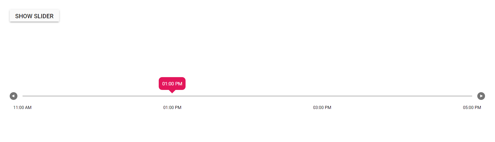

# Show Slider from Hidden State

This section demonstrates how-to render the Slider component in hidden state and make it visible in button click. We can initialize Slider in hidden state by setting display as none to it.

In the sample, by clicking on the button, we can make the Slider visible from hidden state, and we must also call the `refresh` method of the Slider to render it properly based on its original dimensions.
























