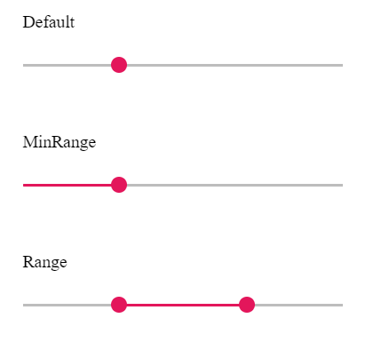

# Types in ##Platform_Name## Range Slider

The types of Slider are as follows:

| **Types** | **Usage** |
| --- | --- |
| Default | Shows a default Slider to select a single value. |
| MinRange | Displays the shadow from the start value to the current selected value. |
| Range | Selects a range of values. It also displays the shadow in-between the selection range. |

N> Both the Default Slider and Min-Range Slider have same behavior that is used to select a single value. In Min-Range Slider, a shadow is considered from the start value to current handle position. But the Range Slider contains two handles that is used to select a range of values and a shadow is considered in between the two handles.
























