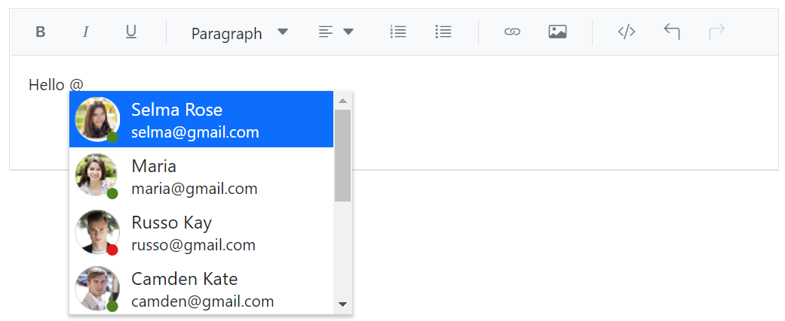

# Mentions in the ASP.NET Core Rich Text Editor Control

By integrating the [Mention](https://ej2.syncfusion.com/aspnetmvc/documentation/mention/getting-started) component with a Rich Text Editor, users can effortlessly mention or tag other users or objects from a suggested list. This eliminates the need to manually type out names or identifying information, improving efficiency and accuracy.

Use the [Target](https://help.syncfusion.com/cr/aspnetmvc-js2/Syncfusion.EJ2.DropDowns.Mention.html#Syncfusion_EJ2_DropDowns_Mention_Target) property of the Mention component to specify the `ID` of the content editable div element within the Rich Text Editor. When setting the target, make sure to append the suffix `_rte-edit-view` to the ID. This allows you to enable the Mention functionality within the Rich Text Editor, so that users can mention or tag other users or objects from the suggested list while editing the text.

When the user types the `@` symbol followed by a character, the Rich Text Editor displays a list of suggestions. Users can then select an item from the list by:

* Clicking on it
* Typing the name of the item they want to tag

In the following sample, we configured the following properties with popup dimensions.

* [AllowSpaces](https://help.syncfusion.com/cr/aspnetmvc-js2/Syncfusion.EJ2.DropDowns.Mention.html#Syncfusion_EJ2_DropDowns_Mention_AllowSpaces) - Allow to continue search action if user enter space after mention character while searching.
* [SuggestionCount](https://help.syncfusion.com/cr/aspnetmvc-js2/Syncfusion.EJ2.DropDowns.Mention.html#Syncfusion_EJ2_DropDowns_Mention_SuggestionCount) - The maximum number of items that will be displayed in the suggestion list.
* [ItemTemplate](https://help.syncfusion.com/cr/aspnetmvc-js2/Syncfusion.EJ2.DropDowns.Mention.html#Syncfusion_EJ2_DropDowns_Mention_ItemTemplate) - Used to display the customized appearance in suggestion list.










> [View Sample](https://ej2.syncfusion.com/aspnetmvc/RichTextEditor/MentionIntegration#/bootstrap5)

## See Also

* [Getting Started with Mention](https://ej2.syncfusion.com/aspnetmvc/documentation/mention/getting-started)