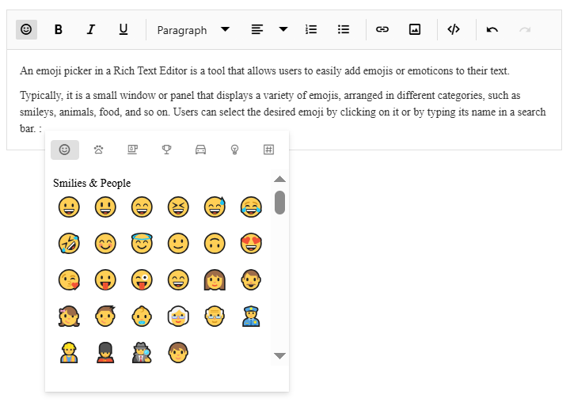

# Emoji Picker in the ##Platform_Name## Rich Text Editor Control

An emoji picker is a tool designed for adding emojis or emoticons to text with ease. It usually appears as a small window or panel showcasing a variety of emojis categorized into sections such as smileys, animals, food, and more. The desired emoji can be selected by clicking on it or typing its name into a search bar.

## Configuring Emoji Picker Tool with Custom Emojis in the Toolbar

Add the `EmojiPicker` tool to the Rich Text Editor toolbar using the `toolbarSettings` [items](https://help.syncfusion.com/cr/aspnetcore-js2/Syncfusion.EJ2.RichTextEditor.RichTextEditorToolbarSettings.html#Syncfusion_EJ2_RichTextEditor_RichTextEditorToolbarSettings_Items) property.

By default, a predefined set of emojis is configured. However, these icons can be customized according to specific needs by using the  [emojiPickerSettings](https://help.syncfusion.com/cr/aspnetcore-js2/Syncfusion.EJ2.RichTextEditor.RichTextEditor.html#Syncfusion_EJ2_RichTextEditor_RichTextEditor_EmojiPickerSettings) property.

The following code example shows how to customize icons in the emoji picker.










Additionally, you have the option to customize the icons of toolbar items using the `iconCss` and [code](../api/rich-text-editor/emojiIconsSet/#code) properties. The `iconCSS` property allows you to define a custom CSS class for the toolbar item icon, while the `code` property enables you to specify the Unicode character code for the icon.

When both `iconCSS` and `code` properties are provided, the `iconCSS` property takes precedence in determining the appearance of the toolbar item icon.

Additionally, you have the option to enhance the user experience by implementing a filtering feature for efficiently managing a large dataset of emojis. By setting the [showSearchBox](https://help.syncfusion.com/cr/aspnetcore-js2/Syncfusion.EJ2.RichTextEditor.RichTextEditorEmojiSettings.html#Syncfusion_EJ2_RichTextEditor_RichTextEditorEmojiSettings_ShowSearchBox) property to `true` (which is the default value), users will be able to utilize a search box to filter the displayed emojis according to their preferences.

The following code example shows how to add the emoji picker tool in the Rich Text Editor.










## Using Shortcut Keys to Open the Emoji Picker

Quickly access the emoji picker by pressing the colon (:) key while typing a word prefix in an editor, allowing instant emoji selection and display. Moreover, continue typing in the editor after the colon (:) to filter and refine your search for the desired emojis.

## Navigating and Selecting Emojis Using the Keyboard

The emoji picker popup offers keyboard navigation options, allowing you to move the emoji focus from one emoji to another. The following keys are used for navigation:

`Arrow keys`: Use the arrow keys (up, down, left, right) to move the emoji focus in the corresponding direction.

`Enter`: Press Enter key to select the currently focused emoji.

`Escape`: Press Escape to close the emoji picker popup without selecting an emoji.