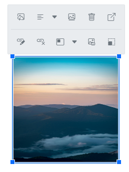

# Images in ##Platform_Name## Rich Text Editor Control

Rich Text Editor allows to insert images in your content from online sources as well as local computer. For inserting an image to the Rich Text Editor, the following list of options have been provided in the [insertImageSettings](https://help.syncfusion.com/cr/aspnetcore-js2/Syncfusion.EJ2.RichTextEditor.RichTextEditorBuilder.html#Syncfusion_EJ2_RichTextEditor_RichTextEditorBuilder_InsertImageSettings_Syncfusion_EJ2_RichTextEditor_RichTextEditorImageSettings_)

## Configuring image tool in the toolbar

You can add an `Image` tool in the Rich Text Editor toolbar using the `toolbarSettings` [items](https://help.syncfusion.com/cr/aspnetcore-js2/Syncfusion.EJ2.RichTextEditor.RichTextEditorToolbarSettings.html#Syncfusion_EJ2_RichTextEditor_RichTextEditorToolbarSettings_Items) property.

To configure the `Image` toolbar item, refer to the below code.
























## Supported image save formats

The images can be saved as `Blob` or `Base64` URL by using the [insertImageSettings.saveFormat](https://help.syncfusion.com/cr/aspnetcore-js2/Syncfusion.EJ2.RichTextEditor.RichTextEditorImageSettings.html#Syncfusion_EJ2_RichTextEditor_RichTextEditorImageSettings_SaveFormat) property, which is of enum type, and the generated URL will be set to the `src` attribute of the `<source>` tag.

```HTML


```

The code snippet below illustrates the configuration of the [insertImageSettings.saveFormat](https://help.syncfusion.com/cr/aspnetcore-js2/Syncfusion.EJ2.RichTextEditor.RichTextEditorImageSettings.html#Syncfusion_EJ2_RichTextEditor_RichTextEditorImageSettings_SaveFormat) property in the Rich Text Editor.

> The default `saveFormat` property is set to `Blob` format.

## Inserting images from web URLs

To insert an image from an online source, click the `Image` tool in the toolbar. By default, this tool opens a dialog box with an input field where you can provide the image URL from the web to insert the image.

## Uploading images from local machine

To insert an image from your local machine, click the `Image` tool in the toolbar. By default, this tool opens a dialog box where you can browse and select an image to insert from your local machine.

## File manager integration for image insertion

To insert images from a file manager, enable the `FileManager` tool on the editor's toolbar. This tool initiates a dialog where you can upload new images and choose from existing ones, facilitating smooth image insertion into your content.

To integrate the file manager into the Rich Text Editor, follow these steps:

* Configure the `FileManager` toolbar item in the `toolbarSettings` API `items` property.
* Set the [`enable`](https://help.syncfusion.com/cr/aspnetcore-js2/Syncfusion.EJ2.RichTextEditor.RichTextEditorFileManagerSettings.html#Syncfusion_EJ2_RichTextEditor_RichTextEditorFileManagerSettings_Enable) property to `true` in the [fileManagerSettings](https://help.syncfusion.com/cr/aspnetcore-js2/syncfusion.ej2.richtexteditor.richtexteditor.html#Syncfusion_EJ2_RichTextEditor_RichTextEditor_FileManagerSettings) property to ensure the file browser appears upon clicking the `FileManager` toolbar item.

## Saving images to server

Upload the selected image to a specified destination using the controller action specified in [insertImageSettings.saveUrl](https://help.syncfusion.com/cr/aspnetcore-js2/Syncfusion.EJ2.RichTextEditor.RichTextEditorImageSettings.html#Syncfusion_EJ2_RichTextEditor_RichTextEditorImageSettings_SaveUrl). Ensure to map this method name appropriately and provide the required destination path through the [insertImageSettings.path](https://help.syncfusion.com/cr/aspnetcore-js2/Syncfusion.EJ2.RichTextEditor.RichTextEditorImageSettings.html#Syncfusion_EJ2_RichTextEditor_RichTextEditorImageSettings_Path) properties.

Configure [insertImageSettings.removeUrl](https://help.syncfusion.com/cr/aspnetcore-js2/Syncfusion.EJ2.RichTextEditor.RichTextEditorImageSettings.html#Syncfusion_EJ2_RichTextEditor_RichTextEditorImageSettings_RemoveUrl) to point to the endpoint responsible for deleting image files.

Set the [insertImageSettings.saveFormat](https://help.syncfusion.com/cr/aspnetcore-js2/Syncfusion.EJ2.RichTextEditor.RichTextEditorImageSettings.html#Syncfusion_EJ2_RichTextEditor_RichTextEditorImageSettings_SaveFormat) property to determine whether the image should be saved as Blob or Base64, aligning with your application's requirements.

> The runnable demo application is available in this [Github](https://github.com/SyncfusionExamples/aspnet-core-richtexteditor-image-upload) repository.
























### Rename images before inserting

You can use the [insertImageSettings](https://help.syncfusion.com/cr/aspnetcore-js2/Syncfusion.EJ2.RichTextEditor.RichTextEditorImageSettings.html#Syncfusion_EJ2_RichTextEditor_RichTextEditorImageSettings) property, to specify the server handler to upload the selected image. Then by binding the [fileUploadSuccess](https://help.syncfusion.com/cr/aspnetcore-js2/syncfusion.ej2.richtexteditor.richtexteditor.html#Syncfusion_EJ2_RichTextEditor_RichTextEditor_FileUploadSuccess) event, you can receive the modified file name from the server and update it in the Rich Text Editor's insert image dialog.

### Size-based image restrictions

You can restrict the image uploaded from the local machine when the uploaded image file size is greater than the allowed size by using the [fileUploading](https://help.syncfusion.com/cr/aspnetcore-js2/syncfusion.ej2.richtexteditor.richtexteditor.html#Syncfusion_EJ2_RichTextEditor_RichTextEditor_FileUploading) event.

> The file size in the argument will be returned in `bytes`.

### Secure image upload with authentication

You can add additional data with the image uploaded from the Rich Text Editor on the client side, which can even be received on the server side. By using the [fileUploading](https://help.syncfusion.com/cr/aspnetcore-js2/syncfusion.ej2.richtexteditor.richtexteditor.html#Syncfusion_EJ2_RichTextEditor_RichTextEditor_FileUploading) event and its `customFormData` argument, you can pass parameters to the controller action. On the server side, you can fetch the custom headers by accessing the form collection from the current request, which retrieves the values sent using the POST method.

> By default, it doesn't support the `UseDefaultCredentials` property, you can manually append the default credentials with the upload request.
























## Image replacement functionality

Once a image file has been inserted, you can replace it using the Rich Text Editor [quickToolbarSettings](https://help.syncfusion.com/cr/aspnetcore-js2/Syncfusion.EJ2.RichTextEditor.RichTextEditorQuickToolbarSettings.html#Syncfusion_EJ2_RichTextEditor_RichTextEditorQuickToolbarSettings) `imageReplace` option. You can replace the image file either by using the web URL or the browse option in the image dialog.

## Deleting image

To remove an image from the Rich Text Editor content, select the image and click `Remove` tool from the quick toolbar. It will delete the image from the Rich Text Editor content as well as from the service location if the `removeUrl` is given.

Once you select the image from the local machine, the URL for the image will be generate. From there, you can remove the image from the service location by clicking the cross icon.


The following sample explains, how to configure `removeUrl` to remove a saved image from the remote service location, when the following image remove actions are performed:

* `delete` key action.
* `backspace` key action.
* Removing uploaded image file from the insert image dialog.
* Deleting image using the quick toolbar `remove` option.
























## Adjusting image dimensions

Sets the default width and height of the image when it is inserted in the Rich Text Editor using [width](https://help.syncfusion.com/cr/aspnetcore-js2/Syncfusion.EJ2.RichTextEditor.RichTextEditorImageSettings.html#Syncfusion_EJ2_RichTextEditor_RichTextEditorImageSettings_Width) and [height](https://help.syncfusion.com/cr/aspnetcore-js2/Syncfusion.EJ2.RichTextEditor.RichTextEditorImageSettings.html#Syncfusion_EJ2_RichTextEditor_RichTextEditorImageSettings_Height) of the [insertImageSettings](https://help.syncfusion.com/cr/aspnetcore-js2/Syncfusion.EJ2.RichTextEditor.RichTextEditorBuilder.html#Syncfusion_EJ2_RichTextEditor_RichTextEditorBuilder_InsertImageSettings_Syncfusion_EJ2_RichTextEditor_RichTextEditorImageSettings_) property.

Through the quick toolbar, change the width and height using `Change Size` option. Once you click, the Image Size dialog box will open as follows. In that you can specify the width and height of the image in pixel.


## Adding captions and Alt text

Image caption and alternative text can be specified for the inserted image in the Rich Text Editor through the [quickToolbarSettings](https://help.syncfusion.com/cr/aspnetcore-js2/Syncfusion.EJ2.RichTextEditor.RichTextEditorQuickToolbarSettings.html#Syncfusion_EJ2_RichTextEditor_RichTextEditorQuickToolbarSettings) property. It has following two options,

* Image Caption
* Alternative Text.

Through the Alternative Text option, set the alternative text for the image, when the image is not upload successfully into the Rich Text Editor.

By clicking the Image Caption, the image will get wrapped in an image element with a caption. Then, you can type caption content inside the Rich Text Editor.

## Configuring image display position

Sets the default display for an image when it is inserted in the Rich Text Editor using [display](https://help.syncfusion.com/cr/aspnetcore-js2/Syncfusion.EJ2.RichTextEditor.RichTextEditorImageSettings.html#Syncfusion_EJ2_RichTextEditor_RichTextEditorImageSettings_Display) field in [insertImageSettings](https://help.syncfusion.com/cr/aspnetcore-js2/Syncfusion.EJ2.RichTextEditor.RichTextEditorBuilder.html#Syncfusion_EJ2_RichTextEditor_RichTextEditorBuilder_InsertImageSettings_Syncfusion_EJ2_RichTextEditor_RichTextEditorImageSettings_). It has two possible options: 'inline' and 'block'.
























## Hyperlinking images

The hyperlink itself can be an image in Rich Text Editor. If the image given as hyperlink, remove, edit and open link will be added to the quick toolbar of image. For further details about link, see the [`link documentation`](../link) documentation.



## Image resizing

Rich Text Editor has a built-in image inserting support.  The resize points will be appearing on each corner of image when focus. So, users can resize the image using mouse points or thumb through the resize points easily. Also, the resize calculation will be done based on aspect ratio.


## Configuring allowed image types

You can allow the specific images alone to be uploaded using the the allowedTypes property. By default, the Rich Text Editor allows the JPG, JPEG, and PNG formats. You can configure this formats as follows.

``` cshtml

    allowedTypes="@(new string[] {".jpg"})"

```

## Drag and drop image insertion

By default, the Rich Text Editor allows you to insert images by drag-and-drop from the local file system such as Windows Explorer into the content editor area. And, you can upload the images to the server before inserting into the editor by configuring the saveUrl property. The images can be repositioned anywhere within the editor area by dragging and dropping the image.

In the following sample, you can see feature demo.
























### Disabling image drag and drop

You can prevent drag-and-drop action by setting the actionBegin argument cancel value to true. The following code shows how to prevent the drag-and-drop.

<script>

    function actionBegin(args) {
        if(args.type === 'drop' || args.type === 'dragstart') {
            args.cancel =true;
        }
    }

</script>

## See also

* [Image Quick Toolbar](../toolbar/quick-toolbar)
* [Hyperlink Management](../link)